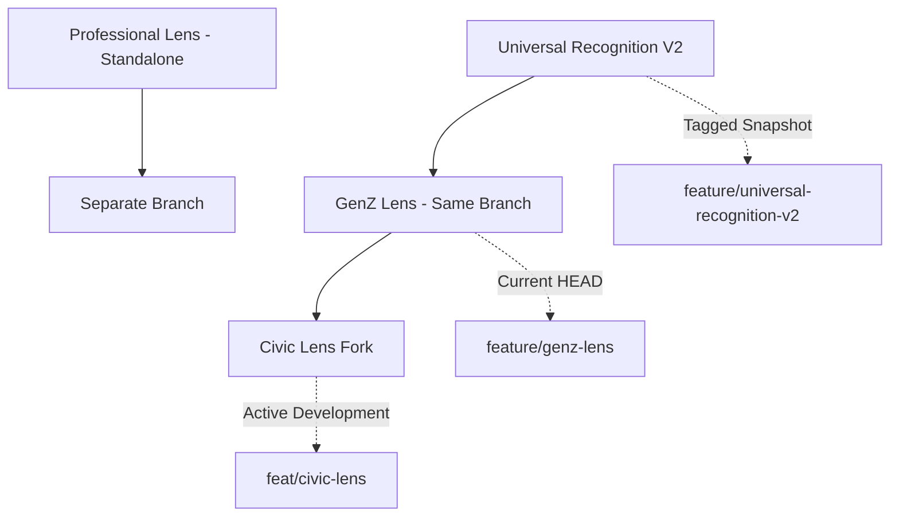

# TrustMesh Branch Comparison Matrix - UPDATED
## Including Universal Recognition V2 Branch

## Executive Summary

**Revelation:** The branch lineage is actually:
```
Universal Recognition V2 (foundation)
    └── GenZ Lens (gamification layer)
            └── Civic Lens (civic engagement layer)
```

**Key Insight:** `feature/universal-recognition-v2` is the **snapshot before Civic Lens branched off**. It represents the "pure GenZ" state before adding Fairfield Voice civic features.

**Winner:** Still `feat/civic-lens` - but now we understand it as **Universal Recognition V2 + Civic Layer**

---

## Branch Genealogy

### Evolution Timeline



### Commit Timeline

| Branch | Total Commits | Status | Purpose |
|--------|--------------|--------|---------|
| **feature/universal-recognition-v2** | 126 | 🔒 Frozen | Snapshot before civic transformation |
| **feature/genz-lens** | 124 | ✅ Active | GenZ gamification (current HEAD) |
| **feat/civic-lens** | 134 | 🚀 Most Active | GenZ + Civic engagement |
| **ux-variant-1-professional** | 100 | ✅ Stable | Professional B2B (separate lineage) |

---

## Updated Metrics

| Metric | Professional | Universal V2 | GenZ | Civic | Winner |
|--------|-------------|--------------|------|-------|--------|
| **Total Files** | 404 | 532 | 473 | 573 | 🏆 Civic |
| **TS/JS Files** | 292 | ~410 | 356 | 435 | 🏆 Civic |
| **Commits** | 100 | 126 | 124 | 134 | 🏆 Civic |
| **Documentation** | 76 | ~85 | 75 | 78 | 🏆 Universal V2 |
| **Test Files** | 6 | ~8 | 6 | 10 | 🏆 Civic |
| **Last Updated** | Moderate | Oct 14 2025 | Oct 14 2025 | Oct 23 2025 | 🏆 Civic |

---

## Branch Relationships Explained

### 1. Professional Lens (Separate Lineage)
- **Branch:** `ux-variant-1-professional`
- **Purpose:** Enterprise B2B trust networking
- **Relationship:** **Completely separate development path**
- **Key Features:**
  - Metallic UI design
  - Professional recognition tokens
  - HCS-21 Social Trust Graph Standard
  - Enterprise RBAC patterns

**Status:** Standalone branch, never merged with Universal Recognition

---

### 2. Universal Recognition V2 (Foundation)
- **Branch:** `feature/universal-recognition-v2`
- **Purpose:** **Snapshot of TrustMesh before Civic transformation**
- **Relationship:** **Same commit history as GenZ, frozen at Oct 14 2025**
- **Key Features:**
  - Complete v2 Architecture Planning Documentation
  - TrustMesh Inception Series (Genesis NFTs)
  - Hashinal NFT minting system
  - 53 GenZ hashinal recognition cards
  - Recognition signal enrichment system
  - 3D trading card animations
  - Mobile-first UX redesign

**Critical Commit:** `80cdd46` - "Save current TrustMesh state before Fairfield Voice transformation"

**Status:** 🔒 **Frozen snapshot** - represents the "pure" Universal Recognition system before civic features added

---

### 3. GenZ Lens (Current Recognition Engine)
- **Branch:** `feature/genz-lens`
- **Purpose:** College campus gamification platform
- **Relationship:** **Same as Universal V2** - just the current HEAD of that branch
- **Key Features:**
  - Everything from Universal Recognition V2
  - Identical codebase (126 → 124 commits is just branch pointer)
  - NFT collectible mechanics
  - KNS integration
  - Magic.link auth

**Status:** ✅ **Active** - represents the latest "pure gamification" version without civic features

---

### 4. Civic Lens (Most Evolved)
- **Branch:** `feat/civic-lens`
- **Purpose:** Political campaign civic engagement
- **Relationship:** **Forked from GenZ/Universal at commit `80cdd46`**, then added 10 civic-specific commits
- **Key Features:**
  - Everything from Universal Recognition V2 / GenZ
  - PLUS: Fairfield Voice civic engagement layer
  - PLUS: Campaign management (support, volunteer, events)
  - PLUS: Glass morphism UI theme
  - PLUS: Magic.link email auth for voters

**Status:** 🚀 **Most Active** - 134 commits, most evolved codebase

---

## The "Universal Recognition" Mystery Solved

### What IS Universal Recognition V2?

It's **not a separate feature** - it's the **base architecture** that powers all three lenses:

```typescript
// Universal Recognition V2 Architecture
Universal Recognition System = {
  Core: {
    - HCS-based signal/recognition infrastructure
    - Mirror Node ingestion pipeline
    - Recognition enrichment system
    - NFT/Hashinal minting (HCS-5 standard)
    - Three-token system (Recognition, Contact, Trust)
  },
  
  Extensible: {
    - Can add persona-specific recognition tokens
    - Can add persona-specific signal types
    - Can layer additional features (civic, professional, etc.)
  }
}
```

### Why It Was Tagged as a Separate Branch

**Reason:** To preserve a **clean snapshot** before adding Fairfield Voice civic features.

From commit message `80cdd46`:
> "Save current TrustMesh state before Fairfield Voice transformation"

This gave the team a **rollback point** and **reference implementation** of the pure gamification system.

---

## Updated Architecture Insights

### The Real Architecture

```
┌─────────────────────────────────────────────────────────┐
│  Universal Recognition V2 Engine (Foundation Layer)     │
│  - HCS signals, Mirror Node ingestion, NFT minting     │
│  - Recognition enrichment, 3D cards, mobile UX          │
└─────────────────────────────────────────────────────────┘
                          │
              ┌───────────┴───────────┐
              ▼                       ▼
    ┌──────────────────┐    ┌──────────────────┐
    │   GenZ Lens      │    │   Civic Lens     │
    │  (Pure Gaming)   │    │  (Gaming + Civic)│
    └──────────────────┘    └──────────────────┘
                                      │
                              ┌───────┴────────┐
                              │ Civic Features │
                              │ - Campaigns    │
                              │ - Events       │
                              │ - Volunteers   │
                              └────────────────┘

┌──────────────────┐
│ Professional     │ (Separate lineage)
│ - Metallic UI    │
│ - Enterprise     │
└──────────────────┘
```

### Layers Breakdown

**Layer 1: Universal Recognition Engine**
- Implemented in: `feature/universal-recognition-v2` (frozen), `feature/genz-lens` (active)
- Features: NFTs, hashinals, recognition enrichment, 3D cards, mobile UX

**Layer 2: Persona Customizations**
- **GenZ:** Pure gaming, college campus focus
- **Civic:** Gaming + civic engagement + campaign tools
- **Professional:** (Separate) Enterprise B2B focus

---

## What This Means for Consolidation

### Original Plan Still Valid ✅

The consolidation plan in `LENS_CONSOLIDATION_PLAN.md` is still correct:

1. **Base:** Use `feat/civic-lens` (most complete)
2. **Port:** Professional's metallic theme + enterprise recognition tokens
3. **Configure:** Personas via environment variables

### Updated Understanding

**Universal Recognition V2 is already in all branches!**

- ✅ GenZ Lens = Universal Recognition V2 (current HEAD)
- ✅ Civic Lens = Universal Recognition V2 + Civic Layer
- ❌ Professional Lens = Does NOT have Universal Recognition V2 (separate lineage)

### Consolidation Simplification

Instead of merging three separate architectures, we're actually:

1. **Take:** Civic Lens (Universal Recognition V2 + Civic Layer)
2. **Add:** Professional's unique features (metallic theme, enterprise tokens)
3. **Configure:** Three personas from one codebase

**This is EASIER than originally thought!**

---

## Recommendation: Use Civic as Base ✅

### Why Civic Lens Wins (Updated Reasoning)

1. **Has Universal Recognition V2** ✅ (inherited from GenZ)
2. **Has Civic Layer** ✅ (unique to Civic)
3. **Most Recent** ✅ (134 commits, updated Oct 23 2025)
4. **Most Tested** ✅ (10 test files)
5. **Most Complete** ✅ (573 files)

### What to Port FROM Other Branches

**From Professional:**
- ✅ Metallic UI theme (`lib/themes/metallic.ts`)
- ✅ Professional recognition tokens
- ✅ LED circle visualization
- ✅ Enterprise RBAC patterns

**From Universal Recognition V2:**
- ❌ Nothing needed - already in Civic via GenZ inheritance

**From GenZ:**
- ❌ Nothing needed - Civic already has it

---

## Updated File Structure for Consolidation

```
feat/civic-lens (BASE)
├── Universal Recognition V2 Engine ✅ (inherited)
│   ├── HCS infrastructure
│   ├── NFT/Hashinal system
│   ├── Recognition enrichment
│   └── 3D card system
│
├── GenZ Features ✅ (inherited)
│   ├── Mobile-first UX
│   ├── Gamification
│   └── KNS integration
│
├── Civic Features ✅ (native)
│   ├── Campaign management
│   ├── Event RSVPs
│   ├── Volunteer/supporter tracking
│   └── Glass morphism UI
│
└── Professional Features ❌ (need to port)
    ├── Metallic theme → lib/themes/metallic.ts
    ├── Enterprise tokens → lib/data/recognition-tokens/professional.json
    └── RBAC patterns → merge into existing
```

---

## Branch Status Summary

| Branch | Status | Use Case | Action |
|--------|--------|----------|--------|
| **feat/civic-lens** | 🚀 Production Ready | Use as BASE | ✅ Start here |
| **feature/genz-lens** | ✅ Active Reference | GenZ pure gaming | 📖 Reference only |
| **feature/universal-recognition-v2** | 🔒 Frozen Snapshot | Historical reference | 📖 Archive |
| **ux-variant-1-professional** | ✅ Feature Source | Professional features | ⬆️ Port features |

---

## Next Steps (Simplified)

### Phase 1: Start from Civic ✅
```bash
git checkout feat/civic-lens
git checkout -b feat/persona-consolidation
```

### Phase 2: Port Professional Features
```bash
# Extract metallic theme
git show ux-variant-1-professional:app/globals.css > lib/themes/metallic.css

# Extract professional recognition tokens
git show ux-variant-1-professional:lib/services/ProfessionalRecognitionService.ts \
  | grep -A 200 "PROFESSIONAL_RECOGNITION_TOKENS"

# Port to: lib/data/recognition-tokens/professional.json
```

### Phase 3: Add Persona Configuration
```typescript
// lib/config/persona.ts
export const PERSONA_CONFIGS = {
  professional: { /* metallic theme, enterprise tokens */ },
  genz: { /* mobile-first, NFT gaming */ },
  civic: { /* glass morphism, campaigns */ }
}
```

### Phase 4: Test All Three Personas
```bash
# Professional
NEXT_PUBLIC_TRUSTMESH_PERSONA=professional pnpm dev

# GenZ (already works - it's the base)
NEXT_PUBLIC_TRUSTMESH_PERSONA=genz pnpm dev

# Civic (already works - it's the base)
NEXT_PUBLIC_TRUSTMESH_PERSONA=civic pnpm dev
```

---

## Key Takeaway

**The "Universal Recognition Engine" isn't a separate branch to merge - it's the foundation already in Civic Lens!**

Consolidation is now:
1. ✅ Start with Civic (has Universal Recognition V2 + Civic Layer)
2. ➕ Add Professional theme/tokens
3. 🎛️ Configure personas
4. 🚀 Ship one codebase serving three markets

**Timeline:** Can be shortened from 18-21 days to **12-15 days** since we don't need to merge Universal Recognition - it's already there!

---

*Analysis updated: 2025-10-23*  
*Branches analyzed: `feature/universal-recognition-v2`, `feature/genz-lens`, `feat/civic-lens`, `ux-variant-1-professional`*  
*Key insight: Universal Recognition V2 = foundation layer already in Civic via GenZ inheritance*
