# 📐 Context Engine PRD v0.1
## Complete Implementation Specification with Sequence Diagrams, Acceptance Criteria, Schemas & Test Matrices

**Version**: 0.1  
**Status**: Implementation Ready  
**Integration**: TrustMesh → Scend → Hedera Sovereignty Infrastructure

---

## 📐 Sequence Diagrams (Mermaid)

### 1) Hot-Path Loop Switch (Rules → Decision → Actions → Audit)

```mermaid
sequenceDiagram
  autonumber
  participant C as Client App
  participant G as Gateway (gRPC/Kafka Ingest)
  participant R as Rule/Pattern Engine
  participant D as Decision Service
  participant A as Action Saga
  participant M as Memory Store (BYOK)
  participant H as Hedera HCS (Audit)

  C->>G: ContextEvent{uid, type, ts, features}
  G->>R: Dispatch by UID partition
  R-->>R: Match rules + (optional) model score
  R->>D: PatternHits[patternId, confidence, suggestedLoop, actions]
  D-->>D: best = max(confidence), if <0.8 keep currentLoop
  D->>A: Start saga with dedupeKey(s)
  par Parallel Action Exec
    A->>A: Check wasExecuted(dedupeKey) → skip if true
    A->>External: Call loop services (XMTP/TRST/etc.)
    A-->>A: Collect statuses (ok/skipped/error)
  end
  A->>M: recordDecision(uid, patternId, actions, rationale)
  A->>H: append AuditRecord(hash, signature)
  A-->>C: DecisionResponse{loop, actions, p99Latency}
```



### 2) Action Saga (Idempotency, Outbox, Rollback)


### 3) Right-to-Forget (RTBF) & Tombstoning


### 4) Trust-Level Proof (Selective Disclosure / ZK Range Proof)

```mermaid
sequenceDiagram
  autonumber
  participant V as Verifier (App)
  participant U as User Wallet
  participant P as Proof Service (Local)
  participant H as Hedera HCS (Commit/Revocation)

  V->>U: Request proof: "≥ N accepted trust tokens from issuerClass=X"
  U->>P: Build proof from local VCs (BBS+/SD-JWT)
  P->>H: Fetch commitments C and revocations R (no PII)
  P-->>U: ZK proof bundle {π, publicParams, ref(HCS)}
  U-->>V: Present proof → verify(π, publicParams, HCS)
  V-->>V: Accept without identities
```



### 5) CraftTrust Treasury Flow (Compliance-Aware)


### 6) Consent Update & Purpose Binding


### 7) Pattern Registry Governance (Signed Config)


---

## ✅ Acceptance Criteria (By Capability)

### A. Event Processing & Loop Switching

* **AC-A1**: For 10,000 synthetic EPS over 60 minutes, hot-path decision p99 latency < 150 ms; drop rate < 1%.
* **AC-A2**: With mixed rule+ML patterns, precision & recall ≥ 0.90 on the labeled evaluation set.
* **AC-A3**: If `confidence < 0.8`, engine **must not** change loop; only execute "safe" actions (UI preload, non-mutating).
* **AC-A4**: Per-UID ordering preserved; no cross-partition reordering.

### B. Idempotency & Sagas

* **AC-B1**: Duplicate `dedupeKey` submissions are skipped (idempotent) with audit entry `ACTION_SKIPPED`.
* **AC-B2**: On side-effect failure, rollback handler executes; outbox marks `failed`; HCS shows `ACTION_ROLLBACK`.
* **AC-B3**: Replays from Kafka (exactly-once semantics) do not cause duplicate external effects.

### C. Privacy & Consent

* **AC-C1**: No PII fields are persisted in `ContextEvent` or `ContextMemory`. Automated scan passes (denylist).
* **AC-C2**: BYOK enforced: without tenant KMS, Memory Store rejects writes.
* **AC-C3**: Consent toggles immediately gate features (e.g., analytics off → no new aggregates). HCS logs consent updates.

### D. Right-to-Forget (RTBF)

* **AC-D1**: RTBF request returns `202 Accepted`; derived features purged within 24h; tombstone flag set.
* **AC-D2**: User added to training exclusion list; next nightly job confirms removal from training corpus.
* **AC-D3**: Immutable HCS commitments remain, but no pointer from uid → commitment is retained.

### E. Trust-Aware Optimizations

* **AC-E1**: "Fast track" actions fire only if rules pass: `acceptedTokens ≥ 7`, `noRecentRevocations(90d) = true`, `activityRecency ≤ 30d`.
* **AC-E2**: Compliance controls (KYC/KYB/OFAC, state regulator checks) are never bypassed by trust level.
* **AC-E3**: Counter-signals cancel fast-track (e.g., `revocationWithin30d`).

### F. Treasury & Cannabis Compliance

* **AC-F1**: For a transaction triggering `cart_value_over_threshold`, engine must call Metrc/State API and receive OK before settlement.
* **AC-F2**: Brale mint/settle results are audited to HCS with transaction hash and tenant nonce.
* **AC-F3**: Failure paths (API down, settlement delay) escalate to messaging loop (XMTP) with redacted alerts.

### G. Explainability & Fairness

* **AC-G1**: ≥ 95% of auto-actions store `rationale` (top features or rule IDs).
* **AC-G2**: Fairness index ≥ 0.95 across defined cohorts; diffs > 5% open an alert.
* **AC-G3**: A/B framework records per-pattern precision/recall and improvement deltas.

### H. Governance & Pattern Registry

* **AC-H1**: New PatternConfig must be signed by ≥ N owners and have explicit expiry ≤ 90d.
* **AC-H2**: Engine refuses to load unsigned/expired configs; writes `PATTERN_REJECTED` to HCS.
* **AC-H3**: Config rollout uses feature flags; rollback within 5 minutes is supported and audited.

---

## 🧾 JSON Schemas (Draft)

### 1) `ContextEvent` (ingest)

```json
{
  "$schema": "https://json-schema.org/draft/2020-12/schema",
  "title": "ContextEvent",
  "type": "object",
  "properties": {
    "uid": { "type": "string", "pattern": "^u_[a-zA-Z0-9_-]{12,}$" },
    "type": { "enum": ["msg","pay","engage","treasury","compliance"] },
    "ts": { "type": "integer", "minimum": 0 },
    "features": { "type": "object", "additionalProperties": { "type": ["string","number","boolean"] } },
    "eventId": { "type": "string" }
  },
  "required": ["uid","type","ts","features"]
}
```

### 2) `PatternConfig` (governance)

```json
{
  "$schema": "https://json-schema.org/draft/2020-12/schema",
  "title": "PatternConfig",
  "type": "object",
  "properties": {
    "id": { "type": "string" },
    "version": { "type": "string" },
    "rules": { "type": "array", "items": { "type": "object" } },
    "modelRef": { "type": "string" },
    "owners": { "type": "array", "items": { "type": "string" }, "minItems": 2 },
    "expiresAt": { "type": "integer" },
    "signature": { "type": "string" },
    "featureFlags": { "type": "object", "additionalProperties": { "type": "boolean" } }
  },
  "required": ["id","version","rules","owners","expiresAt","signature"]
}
```

### 3) `AuditRecord` (HCS append)

```json
{
  "$schema": "https://json-schema.org/draft/2020-12/schema",
  "title": "AuditRecord",
  "type": "object",
  "properties": {
    "uidHash": { "type": "string" },
    "eventId": { "type": "string" },
    "time": { "type": "integer" },
    "patternId": { "type": "string" },
    "actions": {
      "type": "array",
      "items": {
        "type": "object",
        "properties": {
          "type": { "type": "string" },
          "status": { "enum": ["ok","skipped","error","rollback"] },
          "dedupeKey": { "type": "string" }
        },
        "required": ["type","status","dedupeKey"]
      }
    },
    "modelVersion": { "type": "string" },
    "sig": { "type": "string" }
  },
  "required": ["uidHash","eventId","time","patternId","actions","sig"]
}
```

### 4) `ConsentState`

```json
{
  "$schema": "https://json-schema.org/draft/2020-12/schema",
  "title": "ConsentState",
  "type": "object",
  "properties": {
    "personalization": { "type": "boolean" },
    "analytics": { "type": "boolean" },
    "paymentsAssist": { "type": "boolean" }
  },
  "required": ["personalization","analytics","paymentsAssist"]
}
```

---

## 🗂️ Kafka Topics & Contracts

* `tm.events.ingest.v1` — partition key: `uid`
* `tm.events.dlq.v1`
* `tm.pattern.hits.v1`
* `tm.decisions.v1`
* `tm.actions.outbox.v1`
* `tm.actions.results.v1`
* `tm.audit.hcs.queue.v1` (pre-submit)
* `tm.governance.patterns.v1`
* `tm.privacy.rtbf.v1`
* `tm.metrics.fairness.v1`

*All payloads must pass JSON schema validation at ingress; reject to DLQ on failure.*

---

## 🧪 Test Matrices

### Latency & Throughput

| Load     | EPS      | Duration | p95    | p99    | Drops |
| -------- | -------- | -------- | ------ | ------ | ----- |
| Baseline | 2k       | 30m      | <70ms  | <120ms | <0.2% |
| Stress   | 10k      | 60m      | <100ms | <150ms | <1.0% |
| Spike    | 20k (5m) | 5m       | <140ms | <200ms | <2.5% |

### Precision/Recall (per pattern)

| Pattern                      | Support | Precision | Recall |
| ---------------------------- | ------- | --------- | ------ |
| `message_contains_nft_claim` | 2,000   | ≥0.92     | ≥0.90  |
| `payment_pending_over_5min`  | 1,200   | ≥0.91     | ≥0.92  |
| `cart_value_over_threshold`  | 800     | ≥0.93     | ≥0.91  |

### Fairness (beneficial actions)

| Cohort       | Rate | Δ vs. Global | Pass               |
| ------------ | ---- | ------------ | ------------------ |
| New users    | 18%  | -3%          | ✅                  |
| High-trust   | 42%  | +2%          | ✅                  |
| Low-activity | 16%  | -5%          | ⚠ (trigger review) |

---

## 🔒 Security & Privacy Checklist

* [ ] **No PII** in events/memory/logs; automated scanners in CI.
* [ ] **BYOK** enforced (tenant KMS/HSM); reject writes on key failure.
* [ ] **Rotate pseudonymous IDs** per period or risk event; salt all hashes.
* [ ] **TLS 1.3** everywhere; mTLS for internal services.
* [ ] **Secrets** via vault; never in env/plaintext.
* [ ] **DP & k-anon** for aggregates; no small-cell releases.
* [ ] **Access control**: least privilege; per-tenant authZ.
* [ ] **Incident playbooks**: RTBF breach, model bias alert, action rollback storm.

---

## 🧩 Acceptance Tests (Gherkin-style samples)

### AT-01 Loop Switch High-Confidence

```
Given a ContextEvent with features matching pattern "payment_pending_over_5min"
And model confidence = 0.92
When the event is processed
Then the engine switches loop to "messaging"
And an Action "notify_counterparty" is executed once
And an AuditRecord is appended to HCS with status "ok"
```

### AT-05 Low-Confidence Fallback

```
Given a ContextEvent triggering pattern "user_viewing_trust_leaderboard"
And confidence = 0.62
When processed
Then the current loop is unchanged
And only "UI preload" actions are allowed
And an AuditRecord is appended with status "skipped"
```

### AT-11 Idempotent Saga

```
Given an Action with dedupeKey "abc123"
When the same Action is submitted twice within 5s
Then the second execution is skipped
And HCS contains a single "ACTION_OK" entry and one "ACTION_SKIPPED"
```

### AT-20 RTBF

```
Given a user submits an RTBF request
When 24 hours elapse
Then all derived features are purged
And the user is present in the training exclusion list
And an HCS "RTBF_TOMBSTONE" record exists
```

### AT-31 Fast-Track Guardrail

```
Given a user with acceptedTokens = 8
And a revocation occurred within 30 days
When requesting "enable_credit_terms"
Then the action is denied
And an explanation cites "recent_revocation" counter-signal
```

---

## 🎛️ Observability Dashboards (minimum)

* **Latency**: p50/p90/p99 for rule match, decision, saga exec.
* **Accuracy**: precision/recall by pattern, week-over-week.
* **Fairness**: beneficial action rate by cohort; drift monitor.
* **Reliability**: Kafka lag, DLQ rate, saga success/rollback.
* **Privacy**: RTBF SLA tracker; consent toggle volume; PII scanner findings.

---

## 🎯 CraftTrust Treasury Integration

### Enhanced Context Patterns for Cannabis Operations

```typescript
// Cannabis-specific context patterns
const cannabisContextPatterns: ContextPattern[] = [
  {
    trigger: "license_expiration_warning_30d",
    confidence: 0.95,
    suggestedLoop: "compliance_monitoring",
    actions: ["alert_management", "prepare_renewal_docs", "suspend_operations_if_critical"],
    timing: 100,
    complianceFlags: ["license_renewal_required"]
  },
  {
    trigger: "batch_compliance_check_required",
    confidence: 0.93,
    suggestedLoop: "treasury_operations",
    actions: ["verify_metrc_status", "check_lab_results", "validate_seed_to_sale"],
    timing: 200,
    complianceFlags: ["batch_verification_required"]
  },
  {
    trigger: "cash_recycler_capacity_80pct",
    confidence: 0.90,
    suggestedLoop: "treasury_operations", 
    actions: ["schedule_brinks_pickup", "alert_finance_manager", "prepare_settlement_batch"],
    timing: 300,
    complianceFlags: ["cash_capacity_warning"]
  }
];
```

### Treasury-Specific RBAC Integration

```typescript
// Treasury context with RBAC enforcement
interface TreasuryContextEvent extends ContextEvent {
  userRole: 'OWNER' | 'FINANCE_MANAGER' | 'CLERK' | 'VIEWER';
  facilityId: string;
  scopes: TreasuryScope[];
}

// Context-aware treasury actions with permission validation
const validateTreasuryAction = (action: TreasuryAction, userScopes: TreasuryScope[]): boolean => {
  const requiredScopes: Record<string, TreasuryScope[]> = {
    'prepare_trst_mint': ['treasury:config.write'],
    'schedule_settlement': ['treasury:tx.create'],
    'export_compliance_report': ['treasury:export'],
    'view_custody_status': ['treasury:settlement.read']
  };

  return requiredScopes[action.type]?.every(scope => userScopes.includes(scope)) || false;
};
```

---

## 🚀 Implementation Roadmap Integration

### Phase 1: Core Context Engine (Month 1-2)
- [ ] Basic pattern recognition and context switching
- [ ] Memory store with BYOK encryption
- [ ] Kafka event ingestion pipeline
- [ ] HCS audit trail integration

### Phase 2: CraftTrust Treasury Context (Month 2-3)
- [ ] Cannabis-specific context patterns
- [ ] RBAC-aware context switching
- [ ] Brale/Brinks workflow integration
- [ ] Compliance monitoring context loops

### Phase 3: Advanced Intelligence (Month 3-4)
- [ ] ML-driven pattern recognition
- [ ] Trust-aware context optimization
- [ ] Cross-facility context coordination
- [ ] Fairness and bias monitoring

### Phase 4: Production Hardening (Month 4-5)
- [ ] Performance optimization and scaling
- [ ] Security audit and penetration testing
- [ ] Regulatory validation and compliance certification
- [ ] Disaster recovery and business continuity

---

## 📊 Success Metrics & KPIs

### Technical Performance
- **Latency**: <150ms p99 for context switching decisions
- **Throughput**: 10,000+ events per second sustained
- **Accuracy**: >90% precision/recall on pattern recognition
- **Availability**: 99.9% uptime during business hours

### Business Impact
- **Context Switching Accuracy**: >95% correct loop recommendations  
- **Action Success Rate**: >90% of context-driven actions complete successfully
- **User Experience**: 40% reduction in manual workflow steps
- **Compliance**: 100% audit trail coverage for regulatory requirements

### Cannabis-Specific Metrics
- **Compliance Context**: 100% of cannabis transactions trigger compliance validation
- **Treasury Automation**: 60% reduction in manual treasury operations
- **Regulatory Readiness**: <24 hour compliance report generation
- **Cash Flow Optimization**: 25% improvement in settlement efficiency

---

## 🔚 Conclusion: Production-Ready Context Intelligence

This Context Engine PRD v0.1 provides **complete implementation specifications** for building the intelligent nervous system of the TrustMesh ecosystem. With detailed sequence diagrams, acceptance criteria, JSON schemas, and comprehensive test matrices, development teams have everything needed to build production-grade context intelligence.

The integration with CraftTrust Treasury operations demonstrates how **abstract context switching becomes concrete business value** through cannabis compliance automation, treasury optimization, and regulatory confidence.

**The Context Engine transforms reactive applications into predictive, intelligent platforms that anticipate user needs and automate complex workflows while maintaining complete sovereignty guarantees.**

---

*Context Engine PRD v0.1 developed for the TrustMesh → Scend → Hedera sovereignty infrastructure, enabling intelligent automation across trust-based commerce ecosystems.*