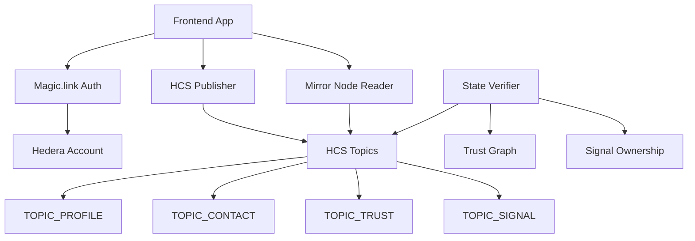

# TrustMesh Developer Implementation Workbook
## Magic.link + Hedera HCS Native Architecture

**Purpose:** A comprehensive implementation guide for your backend development team to build TrustMesh MVP with Magic.link authentication, Hedera Consensus Service (HCS) native storage, and the three core activity loops: **Contacts**, **Circle of 9**, and **Signals**.

**Architecture:** HCS-native (no Solidity), self-custody via Magic.link, state derived from message replay.

**Timeline:** 15-20 hours total implementation across 5 phases.

---

## Table of Contents

1. [Architecture Overview](#1-architecture-overview)
2. [Environment Setup](#2-environment-setup)
3. [Phase-by-Phase Implementation](#3-phase-by-phase-implementation)
4. [Backend Integration Patterns](#4-backend-integration-patterns)
5. [Testing & Validation](#5-testing--validation)
6. [Production Deployment](#6-production-deployment)
7. [Troubleshooting Guide](#7-troubleshooting-guide)

---

## 1) Architecture Overview

### 1.1 Core Components



### 1.2 Integration Architecture

**Magic.link + Hedera Flow:**
1. User authenticates via Magic.link email → gets Hedera account
2. Magic.link provides signing capability for HCS messages
3. All actions (profiles, contacts, trust, signals) stored as HCS messages
4. Frontend subscribes to Mirror Node for real-time updates
5. Backend verifies message integrity and derives application state

**Brale Integration Points:**
- Custodial wallets for stablecoin operations
- KYC/compliance workflows
- TRST token staking mechanisms
- Cross-border payment infrastructure

### 1.3 Message Schema Standard

**Envelope Structure (All Messages):**
```json
{
  "type": "MESSAGE_TYPE",
  "from": "0.0.ACCOUNT_ID", 
  "nonce": 123,
  "ts": 1737152361,
  "payload": { /* type-specific data */ },
  "sig": "ed25519_signature_hex"
}
```

**Signature Verification:**
- Signs: `sha256(type|from|nonce|ts|JSON.stringify(payload))`
- Nonce must be strictly increasing per sender
- All messages must be signed by the `from` account

---

## 2) Environment Setup

### 2.1 Required Dependencies

Add to your existing `package.json`:

```bash
npm install @hashgraph/sdk @magic-sdk/admin @magic-sdk/react zod axios dotenv
npm install --save-dev @types/node ts-node
```

### 2.2 Environment Configuration

Create `.env.local`:

```bash
# Hedera Configuration
HEDERA_NETWORK=testnet
HEDERA_OPERATOR_ID=0.0.YOUR_ACCOUNT_ID
HEDERA_OPERATOR_KEY=302e020100300506032b6570042204...

# Magic.link Configuration  
MAGIC_PUBLISHABLE_KEY=pk_live_or_test_...
MAGIC_SECRET_KEY=sk_live_or_test_...

# HCS Topics (populated by setup script)
TOPIC_PROFILE=
TOPIC_CONTACT=  
TOPIC_TRUST=
TOPIC_SIGNAL=

# Mirror Node Configuration
MIRROR_NODE_URL=https://testnet.mirrornode.hedera.com
MIRROR_NODE_WS=wss://testnet.mirrornode.hedera.com

# Brale Integration (Phase 2)
BRALE_API_URL=https://api.brale.com
BRALE_API_KEY=
BRALE_CLIENT_ID=

# Development Settings
NODE_ENV=development
DEBUG_HCS=true
```

### 2.3 Project Structure

```
TrustMesh_hackathon/
├── app/                          # Next.js App Router
├── components/                   # React Components
│   ├── auth/                    # Magic.link integration
│   ├── hcs/                     # HCS publishers/readers  
│   └── ui/                      # Existing shadcn components
├── lib/
│   ├── hedera/                  # Hedera SDK utilities
│   ├── magic/                   # Magic.link utilities
│   ├── types/                   # TypeScript definitions
│   └── verifier/                # Message validation
├── scripts/
│   ├── setup.ts                # Topic creation
│   └── seedData.ts             # Demo data generation
└── services/                   # API integrations
    ├── TrustMeshAPI.ts         # Backend API client
    ├── MagicService.ts         # Magic.link service
    └── BraleService.ts         # Brale integration
```

---

## 3) Phase-by-Phase Implementation

### Phase 0: Foundation Setup (1-2 hours)

#### Milestone M0: Environment Ready

**Objectives:**
- Create HCS topics
- Verify Magic.link integration
- Establish basic project structure

**Implementation Steps:**

1. **Create Topic Setup Script**

Create `scripts/setup.ts`:

```typescript
import { Client, TopicCreateTransaction, PrivateKey } from '@hashgraph/sdk';
import * as fs from 'fs';
import * as path from 'path';
require('dotenv').config({ path: '.env.local' });

interface TopicConfig {
  name: string;
  memo: string;
  envKey: string;
}

const TOPICS: TopicConfig[] = [
  { name: 'PROFILE', memo: 'TrustMesh HCS-11 Profiles', envKey: 'TOPIC_PROFILE' },
  { name: 'CONTACT', memo: 'TrustMesh Contact Tokens', envKey: 'TOPIC_CONTACT' },
  { name: 'TRUST', memo: 'TrustMesh Circle of 9 Trust', envKey: 'TOPIC_TRUST' },
  { name: 'SIGNAL', memo: 'TrustMesh Recognition Signals', envKey: 'TOPIC_SIGNAL' }
];

async function createTopics() {
  const client = Client.forTestnet().setOperator(
    process.env.HEDERA_OPERATOR_ID!,
    PrivateKey.fromString(process.env.HEDERA_OPERATOR_KEY!)
  );

  console.log('🚀 Creating HCS Topics...\n');
  
  const envUpdates: string[] = [];
  const envPath = path.resolve('.env.local');
  let envContent = fs.readFileSync(envPath, 'utf8');

  for (const topic of TOPICS) {
    try {
      console.log(`Creating ${topic.name} topic...`);
      
      const transaction = new TopicCreateTransaction()
        .setTopicMemo(topic.memo)
        .setAdminKey(client.operatorPublicKey!)
        .setSubmitKey(client.operatorPublicKey!)
        .freezeWith(client);

      const response = await transaction.execute(client);
      const receipt = await response.getReceipt(client);
      const topicId = receipt.topicId!.toString();

      console.log(`✅ ${topic.name}: ${topicId}`);
      
      // Update env file
      const envRegex = new RegExp(`^${topic.envKey}=.*$`, 'm');
      if (envContent.match(envRegex)) {
        envContent = envContent.replace(envRegex, `${topic.envKey}=${topicId}`);
      } else {
        envContent += `\n${topic.envKey}=${topicId}`;
      }
      
      envUpdates.push(`${topic.envKey}=${topicId}`);
    } catch (error) {
      console.error(`❌ Failed to create ${topic.name}:`, error);
      throw error;
    }
  }

  fs.writeFileSync(envPath, envContent);
  console.log('\n📝 Updated .env.local with topic IDs');
  console.log('\n🎉 Setup complete! Topics ready for use.');
}

createTopics().catch(console.error);
```

2. **Create Hedera Client Utility**

Create `lib/hedera/client.ts`:

```typescript
import { Client, PrivateKey, TopicMessageSubmitTransaction } from '@hashgraph/sdk';

export interface HederaConfig {
  network: 'testnet' | 'mainnet';
  operatorId: string;
  operatorKey: string;
}

export class HederaClient {
  private client: Client;
  private operatorKey: PrivateKey;

  constructor(config: HederaConfig) {
    this.client = config.network === 'testnet' 
      ? Client.forTestnet() 
      : Client.forMainnet();
    
    this.operatorKey = PrivateKey.fromString(config.operatorKey);
    this.client.setOperator(config.operatorId, this.operatorKey);
  }

  async submitMessage(topicId: string, message: string): Promise<{
    transactionId: string;
    consensusTimestamp: string;
    sequenceNumber: number;
  }> {
    const transaction = new TopicMessageSubmitTransaction()
      .setTopicId(topicId)
      .setMessage(message)
      .freezeWith(this.client);

    const response = await transaction.execute(this.client);
    const receipt = await response.getReceipt(this.client);
    
    return {
      transactionId: response.transactionId.toString(),
      consensusTimestamp: receipt.consensusTimestamp!.toString(),
      sequenceNumber: receipt.topicSequenceNumber!.toNumber()
    };
  }

  getClient(): Client {
    return this.client;
  }

  close(): void {
    this.client.close();
  }
}
```

3. **Run Setup**

```bash
npx ts-node scripts/setup.ts
```

**Acceptance Criteria:**
- [ ] All 4 topics created successfully
- [ ] `.env.local` populated with topic IDs
- [ ] No errors in topic creation process

---

### Phase 1: Magic.link Authentication Integration (3-4 hours)

#### Milestone M1: Magic.link Auth + SIWH

**Objectives:**
- Implement Magic.link authentication with email
- Create Sign-In-With-Hedera (SIWH) flow
- Establish nonce management system
- Build profile management UI

**Implementation Steps:**

1. **Create Magic Service**

Create `services/MagicService.ts`:

```typescript
import { Magic } from 'magic-sdk';
import { HederaExtension } from '@magic-ext/hedera';
import { HederaNetwork } from '@hashgraph/sdk';

export interface MagicConfig {
  publishableKey: string;
  network: 'testnet' | 'mainnet';
}

export interface UserAuth {
  email: string;
  hederaAccountId: string;
  publicKey: string;
  isLoggedIn: boolean;
}

export class MagicService {
  private magic: Magic;
  private currentUser: UserAuth | null = null;

  constructor(config: MagicConfig) {
    this.magic = new Magic(config.publishableKey, {
      extensions: {
        hedera: new HederaExtension({
          network: config.network === 'testnet' 
            ? HederaNetwork.Testnet 
            : HederaNetwork.Mainnet
        })
      }
    });
  }

  async login(email: string): Promise<UserAuth> {
    try {
      // Magic link authentication
      await this.magic.auth.loginWithMagicLink({ email });
      
      // Get Hedera account info
      const metadata = await this.magic.user.getMetadata();
      const hederaAccount = await this.magic.hedera.getAccount();
      
      this.currentUser = {
        email: metadata.email!,
        hederaAccountId: hederaAccount.accountId,
        publicKey: hederaAccount.publicKey,
        isLoggedIn: true
      };

      return this.currentUser;
    } catch (error) {
      console.error('Magic login failed:', error);
      throw new Error('Authentication failed');
    }
  }

  async logout(): Promise<void> {
    await this.magic.user.logout();
    this.currentUser = null;
  }

  async isLoggedIn(): Promise<boolean> {
    return await this.magic.user.isLoggedIn();
  }

  async signMessage(message: string): Promise<string> {
    if (!this.currentUser) {
      throw new Error('User not authenticated');
    }
    
    const signature = await this.magic.hedera.sign(message);
    return signature.signature;
  }

  getCurrentUser(): UserAuth | null {
    return this.currentUser;
  }

  getMagicInstance(): Magic {
    return this.magic;
  }
}
```

2. **Create Authentication Hook**

Create `lib/hooks/useAuth.ts`:

```typescript
import { useState, useEffect, useContext, createContext } from 'react';
import { MagicService, UserAuth } from '@/services/MagicService';

interface AuthContextType {
  user: UserAuth | null;
  login: (email: string) => Promise<UserAuth>;
  logout: () => Promise<void>;
  isLoading: boolean;
  signMessage: (message: string) => Promise<string>;
}

const AuthContext = createContext<AuthContextType | null>(null);

export function AuthProvider({ children }: { children: React.ReactNode }) {
  const [user, setUser] = useState<UserAuth | null>(null);
  const [isLoading, setIsLoading] = useState(true);
  const [magicService] = useState(() => new MagicService({
    publishableKey: process.env.NEXT_PUBLIC_MAGIC_PUBLISHABLE_KEY!,
    network: process.env.NEXT_PUBLIC_HEDERA_NETWORK as 'testnet' | 'mainnet'
  }));

  useEffect(() => {
    checkAuthStatus();
  }, []);

  const checkAuthStatus = async () => {
    try {
      const isLoggedIn = await magicService.isLoggedIn();
      if (isLoggedIn) {
        const currentUser = magicService.getCurrentUser();
        if (currentUser) {
          setUser(currentUser);
        }
      }
    } catch (error) {
      console.error('Auth check failed:', error);
    } finally {
      setIsLoading(false);
    }
  };

  const login = async (email: string): Promise<UserAuth> => {
    setIsLoading(true);
    try {
      const userData = await magicService.login(email);
      setUser(userData);
      return userData;
    } finally {
      setIsLoading(false);
    }
  };

  const logout = async (): Promise<void> => {
    setIsLoading(true);
    try {
      await magicService.logout();
      setUser(null);
    } finally {
      setIsLoading(false);
    }
  };

  const signMessage = async (message: string): Promise<string> => {
    return await magicService.signMessage(message);
  };

  return (
    <AuthContext.Provider value={{ user, login, logout, isLoading, signMessage }}>
      {children}
    </AuthContext.Provider>
  );
}

export function useAuth(): AuthContextType {
  const context = useContext(AuthContext);
  if (!context) {
    throw new Error('useAuth must be used within AuthProvider');
  }
  return context;
}
```

3. **Create Authentication Component**

Create `components/auth/MagicAuth.tsx`:

```typescript
"use client";

import { useState } from 'react';
import { Button } from '@/components/ui/button';
import { Input } from '@/components/ui/input';
import { Card, CardContent, CardHeader, CardTitle } from '@/components/ui/card';
import { Badge } from '@/components/ui/badge';
import { Mail, LogOut, Copy } from 'lucide-react';
import { useAuth } from '@/lib/hooks/useAuth';
import { toast } from 'sonner';

export function MagicAuth() {
  const { user, login, logout, isLoading } = useAuth();
  const [email, setEmail] = useState('');
  const [isLoggingIn, setIsLoggingIn] = useState(false);

  const handleLogin = async (e: React.FormEvent) => {
    e.preventDefault();
    if (!email) return;

    setIsLoggingIn(true);
    try {
      await login(email);
      toast.success('Successfully logged in!');
      setEmail('');
    } catch (error) {
      toast.error('Login failed. Please try again.');
    } finally {
      setIsLoggingIn(false);
    }
  };

  const handleLogout = async () => {
    try {
      await logout();
      toast.success('Logged out successfully');
    } catch (error) {
      toast.error('Logout failed');
    }
  };

  const copyAddress = async () => {
    if (user?.hederaAccountId) {
      await navigator.clipboard.writeText(user.hederaAccountId);
      toast.success('Address copied to clipboard');
    }
  };

  if (isLoading) {
    return (
      <Card className="w-full max-w-md mx-auto">
        <CardContent className="p-6 text-center">
          <div className="animate-spin rounded-full h-8 w-8 border-b-2 border-green-600 mx-auto"></div>
          <p className="mt-2 text-sm text-slate-500">Checking authentication...</p>
        </CardContent>
      </Card>
    );
  }

  if (user) {
    return (
      <Card className="w-full max-w-md mx-auto border-green-200">
        <CardHeader>
          <CardTitle className="flex items-center gap-2">
            <div className="w-8 h-8 rounded-full bg-green-600 flex items-center justify-center">
              <span className="text-white text-sm font-bold">✓</span>
            </div>
            Connected
          </CardTitle>
        </CardHeader>
        <CardContent className="space-y-4">
          <div>
            <label className="text-sm font-medium text-slate-700">Email</label>
            <p className="text-slate-900">{user.email}</p>
          </div>
          
          <div>
            <label className="text-sm font-medium text-slate-700">Hedera Account</label>
            <div className="flex items-center gap-2 mt-1">
              <code className="text-sm bg-slate-100 px-2 py-1 rounded flex-1">
                {user.hederaAccountId}
              </code>
              <Button size="sm" variant="outline" onClick={copyAddress}>
                <Copy className="h-3 w-3" />
              </Button>
            </div>
          </div>
          
          <div>
            <Badge className="bg-green-100 text-green-800">
              Self-custody via Magic.link
            </Badge>
          </div>
          
          <Button onClick={handleLogout} variant="outline" className="w-full">
            <LogOut className="h-4 w-4 mr-2" />
            Logout
          </Button>
        </CardContent>
      </Card>
    );
  }

  return (
    <Card className="w-full max-w-md mx-auto">
      <CardHeader>
        <CardTitle>Connect to TrustMesh</CardTitle>
        <p className="text-sm text-slate-600">
          Sign in with email to get your Hedera account
        </p>
      </CardHeader>
      <CardContent>
        <form onSubmit={handleLogin} className="space-y-4">
          <div>
            <Input
              type="email"
              placeholder="Enter your email"
              value={email}
              onChange={(e) => setEmail(e.target.value)}
              required
              className="w-full"
            />
          </div>
          <Button 
            type="submit" 
            disabled={!email || isLoggingIn}
            className="w-full bg-green-600 hover:bg-green-700"
          >
            {isLoggingIn ? (
              <div className="flex items-center gap-2">
                <div className="animate-spin rounded-full h-4 w-4 border-b-2 border-white"></div>
                Connecting...
              </div>
            ) : (
              <div className="flex items-center gap-2">
                <Mail className="h-4 w-4" />
                Send Magic Link
              </div>
            )}
          </Button>
        </form>
        
        <div className="mt-4 text-center">
          <p className="text-xs text-slate-500">
            Powered by Magic.link • Self-custody wallet
          </p>
        </div>
      </CardContent>
    </Card>
  );
}
```

4. **Create HCS Message Publisher Hook**

Create `lib/hooks/useHcsPublisher.ts`:

```typescript
import { useState } from 'react';
import { useAuth } from './useAuth';
import { HederaClient } from '@/lib/hedera/client';
import { createHash } from 'crypto';
import { z } from 'zod';

// Message envelope schema
const MessageEnvelopeSchema = z.object({
  type: z.string(),
  from: z.string(),
  nonce: z.number(),
  ts: z.number(),
  payload: z.record(z.any()),
  sig: z.string()
});

export type MessageEnvelope = z.infer<typeof MessageEnvelopeSchema>;

export interface PublishResult {
  success: boolean;
  transactionId?: string;
  consensusTimestamp?: string;
  sequenceNumber?: number;
  error?: string;
}

interface NonceState {
  [accountId: string]: number;
}

export function useHcsPublisher() {
  const { user, signMessage } = useAuth();
  const [isPublishing, setIsPublishing] = useState(false);
  const [nonceState, setNonceState] = useState<NonceState>({});
  
  const getNextNonce = (accountId: string): number => {
    const currentNonce = nonceState[accountId] || 0;
    const nextNonce = currentNonce + 1;
    setNonceState(prev => ({ ...prev, [accountId]: nextNonce }));
    return nextNonce;
  };

  const createMessageHash = (envelope: Omit<MessageEnvelope, 'sig'>): string => {
    const message = `${envelope.type}|${envelope.from}|${envelope.nonce}|${envelope.ts}|${JSON.stringify(envelope.payload)}`;
    return createHash('sha256').update(message).digest('hex');
  };

  const publishMessage = async (
    topicId: string,
    messageType: string,
    payload: Record<string, any>
  ): Promise<PublishResult> => {
    if (!user) {
      return { success: false, error: 'User not authenticated' };
    }

    setIsPublishing(true);
    
    try {
      // Create envelope
      const envelope: Omit<MessageEnvelope, 'sig'> = {
        type: messageType,
        from: user.hederaAccountId,
        nonce: getNextNonce(user.hederaAccountId),
        ts: Math.floor(Date.now() / 1000),
        payload
      };

      // Create hash to sign
      const messageHash = createMessageHash(envelope);
      
      // Sign with Magic.link
      const signature = await signMessage(messageHash);
      
      // Complete envelope
      const signedEnvelope: MessageEnvelope = {
        ...envelope,
        sig: signature
      };

      // Validate envelope
      const validatedEnvelope = MessageEnvelopeSchema.parse(signedEnvelope);

      // Submit to HCS
      const hederaClient = new HederaClient({
        network: process.env.NEXT_PUBLIC_HEDERA_NETWORK as 'testnet' | 'mainnet',
        operatorId: process.env.NEXT_PUBLIC_HEDERA_OPERATOR_ID!,
        operatorKey: process.env.NEXT_PUBLIC_HEDERA_OPERATOR_KEY!
      });

      const result = await hederaClient.submitMessage(
        topicId,
        JSON.stringify(validatedEnvelope)
      );

      hederaClient.close();

      return {
        success: true,
        transactionId: result.transactionId,
        consensusTimestamp: result.consensusTimestamp,
        sequenceNumber: result.sequenceNumber
      };

    } catch (error) {
      console.error('Message publishing failed:', error);
      return {
        success: false,
        error: error instanceof Error ? error.message : 'Unknown error'
      };
    } finally {
      setIsPublishing(false);
    }
  };

  return {
    publishMessage,
    isPublishing
  };
}
```

**Acceptance Criteria:**
- [ ] Magic.link login flow works with email
- [ ] User receives Hedera account after authentication
- [ ] Message signing works through Magic.link
- [ ] Nonce management prevents replay attacks
- [ ] Error handling for auth failures

---

### Phase 2: Profile Management (HCS-11) (2-3 hours)

#### Milestone M2: Profile Creation and Updates

**Objectives:**
- Implement HCS-11 profile standard
- Create profile editor UI
- Add profile validation
- Display profile in activity feed

**Implementation Steps:**

1. **Define Profile Types**

Create `lib/types/ProfileTypes.ts`:

```typescript
import { z } from 'zod';

const ProfilePayloadSchema = z.object({
  handle: z.string().min(2).max(50).regex(/^[a-zA-Z0-9_]+$/),
  avatar: z.string().optional(), // sha256 hash or URL
  bio: z.string().max(200).optional(),
  visibility: z.enum(['public', 'private', 'contacts']),
  website: z.string().url().optional(),
  location: z.string().max(100).optional()
});

export type ProfilePayload = z.infer<typeof ProfilePayloadSchema>;

export interface Profile extends ProfilePayload {
  accountId: string;
  updatedAt: string;
  sequenceNumber: number;
  hrl: string; // HCS-11 reference
}

export const ProfileSchema = {
  payload: ProfilePayloadSchema
};
```

2. **Create Profile Service**

Create `services/ProfileService.ts`:

```typescript
import { ProfilePayload, Profile, ProfileSchema } from '@/lib/types/ProfileTypes';
import { useHcsPublisher } from '@/lib/hooks/useHcsPublisher';
import { MessageEnvelope } from '@/lib/hooks/useHcsPublisher';

export class ProfileService {
  private topicId: string;

  constructor(topicId: string) {
    this.topicId = topicId;
  }

  async updateProfile(profileData: ProfilePayload): Promise<{
    success: boolean;
    hrl?: string;
    error?: string;
  }> {
    try {
      // Validate profile data
      const validatedProfile = ProfileSchema.payload.parse(profileData);
      
      // Use HCS publisher to submit
      const publisher = useHcsPublisher();
      const result = await publisher.publishMessage(
        this.topicId,
        'PROFILE_UPDATE',
        validatedProfile
      );

      if (result.success) {
        // Create HRL (Hedera Resource Locator)
        const hrl = `hcs://11/${this.topicId}/${result.sequenceNumber}`;
        return { success: true, hrl };
      }

      return { success: false, error: result.error };
    } catch (error) {
      return {
        success: false,
        error: error instanceof Error ? error.message : 'Profile update failed'
      };
    }
  }

  // Derive current profile from message history
  deriveProfileFromMessages(messages: MessageEnvelope[]): Profile | null {
    const profileMessages = messages
      .filter(msg => msg.type === 'PROFILE_UPDATE')
      .sort((a, b) => b.ts - a.ts); // Most recent first

    if (profileMessages.length === 0) return null;

    const latest = profileMessages[0];
    return {
      accountId: latest.from,
      updatedAt: new Date(latest.ts * 1000).toISOString(),
      sequenceNumber: 0, // Would need to get from Mirror Node
      hrl: `hcs://11/${this.topicId}/0`, // Would need actual sequence
      ...latest.payload as ProfilePayload
    };
  }
}
```

3. **Create Profile Editor Component**

Create `components/profile/ProfileEditor.tsx`:

```typescript
"use client";

import { useState } from 'react';
import { Button } from '@/components/ui/button';
import { Input } from '@/components/ui/input';
import { Textarea } from '@/components/ui/textarea';
import { Select, SelectContent, SelectItem, SelectTrigger, SelectValue } from '@/components/ui/select';
import { Card, CardContent, CardHeader, CardTitle } from '@/components/ui/card';
import { Badge } from '@/components/ui/badge';
import { User, Save, Eye, Users, Lock } from 'lucide-react';
import { ProfilePayload, ProfileSchema } from '@/lib/types/ProfileTypes';
import { useHcsPublisher } from '@/lib/hooks/useHcsPublisher';
import { useAuth } from '@/lib/hooks/useAuth';
import { toast } from 'sonner';

interface ProfileEditorProps {
  initialProfile?: Partial<ProfilePayload>;
  onProfileUpdated?: (hrl: string) => void;
}

export function ProfileEditor({ initialProfile, onProfileUpdated }: ProfileEditorProps) {
  const { user } = useAuth();
  const { publishMessage, isPublishing } = useHcsPublisher();
  const [profile, setProfile] = useState<ProfilePayload>({
    handle: initialProfile?.handle || '',
    bio: initialProfile?.bio || '',
    visibility: initialProfile?.visibility || 'public',
    website: initialProfile?.website || '',
    location: initialProfile?.location || ''
  });
  const [errors, setErrors] = useState<Record<string, string>>({});

  const validateProfile = (): boolean => {
    try {
      ProfileSchema.payload.parse(profile);
      setErrors({});
      return true;
    } catch (error: any) {
      const fieldErrors: Record<string, string> = {};
      if (error.errors) {
        error.errors.forEach((err: any) => {
          fieldErrors[err.path[0]] = err.message;
        });
      }
      setErrors(fieldErrors);
      return false;
    }
  };

  const handleSubmit = async (e: React.FormEvent) => {
    e.preventDefault();
    
    if (!user || !validateProfile()) return;

    try {
      const result = await publishMessage(
        process.env.NEXT_PUBLIC_TOPIC_PROFILE!,
        'PROFILE_UPDATE',
        profile
      );

      if (result.success) {
        toast.success('Profile updated successfully!');
        const hrl = `hcs://11/${process.env.NEXT_PUBLIC_TOPIC_PROFILE}/${result.sequenceNumber}`;
        onProfileUpdated?.(hrl);
      } else {
        toast.error(`Profile update failed: ${result.error}`);
      }
    } catch (error) {
      toast.error('Unexpected error updating profile');
    }
  };

  const getVisibilityIcon = (visibility: string) => {
    switch (visibility) {
      case 'public': return <Eye className="h-4 w-4" />;
      case 'contacts': return <Users className="h-4 w-4" />;
      case 'private': return <Lock className="h-4 w-4" />;
      default: return <Eye className="h-4 w-4" />;
    }
  };

  return (
    <Card className="w-full">
      <CardHeader>
        <CardTitle className="flex items-center gap-2">
          <User className="h-5 w-5" />
          Profile Settings
        </CardTitle>
        <p className="text-sm text-slate-600">
          Your profile is stored on Hedera Consensus Service (HCS-11)
        </p>
      </CardHeader>
      <CardContent>
        <form onSubmit={handleSubmit} className="space-y-4">
          <div>
            <label className="block text-sm font-medium mb-1">Handle</label>
            <Input
              value={profile.handle}
              onChange={(e) => setProfile({ ...profile, handle: e.target.value })}
              placeholder="your_username"
              className={errors.handle ? 'border-red-500' : ''}
            />
            {errors.handle && (
              <p className="text-sm text-red-600 mt-1">{errors.handle}</p>
            )}
          </div>

          <div>
            <label className="block text-sm font-medium mb-1">Bio</label>
            <Textarea
              value={profile.bio}
              onChange={(e) => setProfile({ ...profile, bio: e.target.value })}
              placeholder="Tell others about yourself..."
              rows={3}
              className={errors.bio ? 'border-red-500' : ''}
            />
            {errors.bio && (
              <p className="text-sm text-red-600 mt-1">{errors.bio}</p>
            )}
          </div>

          <div>
            <label className="block text-sm font-medium mb-1">Website</label>
            <Input
              type="url"
              value={profile.website}
              onChange={(e) => setProfile({ ...profile, website: e.target.value })}
              placeholder="https://yourwebsite.com"
              className={errors.website ? 'border-red-500' : ''}
            />
            {errors.website && (
              <p className="text-sm text-red-600 mt-1">{errors.website}</p>
            )}
          </div>

          <div>
            <label className="block text-sm font-medium mb-1">Location</label>
            <Input
              value={profile.location}
              onChange={(e) => setProfile({ ...profile, location: e.target.value })}
              placeholder="City, Country"
              className={errors.location ? 'border-red-500' : ''}
            />
            {errors.location && (
              <p className="text-sm text-red-600 mt-1">{errors.location}</p>
            )}
          </div>

          <div>
            <label className="block text-sm font-medium mb-1">Visibility</label>
            <Select 
              value={profile.visibility} 
              onValueChange={(value: 'public' | 'private' | 'contacts') => 
                setProfile({ ...profile, visibility: value })
              }
            >
              <SelectTrigger>
                <SelectValue />
              </SelectTrigger>
              <SelectContent>
                <SelectItem value="public">
                  <div className="flex items-center gap-2">
                    <Eye className="h-4 w-4" />
                    Public - Everyone can see
                  </div>
                </SelectItem>
                <SelectItem value="contacts">
                  <div className="flex items-center gap-2">
                    <Users className="h-4 w-4" />
                    Contacts - Only connections
                  </div>
                </SelectItem>
                <SelectItem value="private">
                  <div className="flex items-center gap-2">
                    <Lock className="h-4 w-4" />
                    Private - Hidden
                  </div>
                </SelectItem>
              </SelectContent>
            </Select>
          </div>

          <div className="flex items-center gap-2 pt-2">
            <Button 
              type="submit" 
              disabled={isPublishing || !user}
              className="bg-green-600 hover:bg-green-700"
            >
              {isPublishing ? (
                <div className="flex items-center gap-2">
                  <div className="animate-spin rounded-full h-4 w-4 border-b-2 border-white"></div>
                  Updating...
                </div>
              ) : (
                <div className="flex items-center gap-2">
                  <Save className="h-4 w-4" />
                  Update Profile
                </div>
              )}
            </Button>
            
            <Badge className="bg-blue-100 text-blue-800">
              HCS-11 Standard
            </Badge>
          </div>
        </form>
        
        {user && (
          <div className="mt-4 p-3 bg-slate-50 rounded-lg">
            <p className="text-xs text-slate-600">
              Profile will be linked to account: <code className="bg-white px-1 py-0.5 rounded">{user.hederaAccountId}</code>
            </p>
          </div>
        )}
      </CardContent>
    </Card>
  );
}
```

**Acceptance Criteria:**
- [ ] Profile can be created and updated
- [ ] Profile follows HCS-11 standard
- [ ] Validation prevents invalid data
- [ ] Profile updates appear in activity feed
- [ ] HRL (Hedera Resource Locator) generated correctly

---

### Phase 3: Contact Management (3-4 hours)

#### Milestone M3: Contact Token Implementation

**Objectives:**
- Implement contact request/accept flow
- Create QR code sharing for easy connection
- Display mutual connections
- Store HCS-11 profile references

**Implementation Steps:**

1. **Define Contact Types**

Create `lib/types/ContactTypes.ts`:

```typescript
import { z } from 'zod';

const ContactRequestPayloadSchema = z.object({
  to: z.string(), // Target account ID
  fromProfileId: z.string(),
  fromProfileHrl: z.string() // Reference to sender's profile
});

const ContactAcceptPayloadSchema = z.object({
  of: z.string(), // Hash of the original request
  to: z.string(), // Original sender
  toProfileId: z.string(),
  toProfileHrl: z.string() // Reference to accepter's profile
});

export type ContactRequestPayload = z.infer<typeof ContactRequestPayloadSchema>;
export type ContactAcceptPayload = z.infer<typeof ContactAcceptPayloadSchema>;

export interface Contact {
  accountId: string;
  profileHrl: string;
  handle?: string;
  status: 'pending_sent' | 'pending_received' | 'active';
  connectedAt: string;
  mutualConnections: number;
}

export const ContactSchema = {
  request: ContactRequestPayloadSchema,
  accept: ContactAcceptPayloadSchema
};
```

2. **Create Contact Service**

Create `services/ContactService.ts`:

```typescript
import { ContactRequestPayload, ContactAcceptPayload, Contact, ContactSchema } from '@/lib/types/ContactTypes';
import { useHcsPublisher, MessageEnvelope } from '@/lib/hooks/useHcsPublisher';
import { createHash } from 'crypto';

export class ContactService {
  private topicId: string;

  constructor(topicId: string) {
    this.topicId = topicId;
  }

  async sendContactRequest(targetAccountId: string, profileHrl: string): Promise<{
    success: boolean;
    error?: string;
  }> {
    try {
      const requestPayload: ContactRequestPayload = {
        to: targetAccountId,
        fromProfileId: targetAccountId, // Will be set by publisher
        fromProfileHrl: profileHrl
      };

      ContactSchema.request.parse(requestPayload);
      
      const publisher = useHcsPublisher();
      const result = await publisher.publishMessage(
        this.topicId,
        'CONTACT_REQUEST',
        requestPayload
      );

      return { success: result.success, error: result.error };
    } catch (error) {
      return {
        success: false,
        error: error instanceof Error ? error.message : 'Failed to send contact request'
      };
    }
  }

  async acceptContactRequest(requestHash: string, requesterId: string, profileHrl: string): Promise<{
    success: boolean;
    error?: string;
  }> {
    try {
      const acceptPayload: ContactAcceptPayload = {
        of: requestHash,
        to: requesterId,
        toProfileId: requesterId, // Will be set by publisher
        toProfileHrl: profileHrl
      };

      ContactSchema.accept.parse(acceptPayload);
      
      const publisher = useHcsPublisher();
      const result = await publisher.publishMessage(
        this.topicId,
        'CONTACT_ACCEPT', 
        acceptPayload
      );

      return { success: result.success, error: result.error };
    } catch (error) {
      return {
        success: false,
        error: error instanceof Error ? error.message : 'Failed to accept contact request'
      };
    }
  }

  // Derive contact relationships from message history
  deriveContactsFromMessages(messages: MessageEnvelope[], currentAccountId: string): Contact[] {
    const contacts: Map<string, Contact> = new Map();
    const requests = new Map<string, MessageEnvelope>();
    
    // Process all contact messages
    const contactMessages = messages.filter(msg => 
      msg.type === 'CONTACT_REQUEST' || msg.type === 'CONTACT_ACCEPT'
    );

    // First pass: collect requests
    contactMessages
      .filter(msg => msg.type === 'CONTACT_REQUEST')
      .forEach(msg => {
        const requestHash = createHash('sha256')
          .update(JSON.stringify({ type: msg.type, from: msg.from, payload: msg.payload }))
          .digest('hex');
        requests.set(requestHash, msg);

        // Add as pending contact
        if (msg.from === currentAccountId) {
          // Outgoing request
          contacts.set(msg.payload.to, {
            accountId: msg.payload.to,
            profileHrl: '', // Would need to fetch
            status: 'pending_sent',
            connectedAt: new Date(msg.ts * 1000).toISOString(),
            mutualConnections: 0
          });
        } else if (msg.payload.to === currentAccountId) {
          // Incoming request
          contacts.set(msg.from, {
            accountId: msg.from,
            profileHrl: msg.payload.fromProfileHrl,
            status: 'pending_received',
            connectedAt: new Date(msg.ts * 1000).toISOString(),
            mutualConnections: 0
          });
        }
      });

    // Second pass: process accepts
    contactMessages
      .filter(msg => msg.type === 'CONTACT_ACCEPT')
      .forEach(msg => {
        const originalRequest = requests.get(msg.payload.of);
        if (originalRequest) {
          // Mark as active connection
          if (originalRequest.from === currentAccountId) {
            // Our request was accepted
            const contact = contacts.get(originalRequest.payload.to);
            if (contact) {
              contact.status = 'active';
              contact.profileHrl = msg.payload.toProfileHrl;
            }
          } else if (msg.from === currentAccountId) {
            // We accepted their request
            const contact = contacts.get(originalRequest.from);
            if (contact) {
              contact.status = 'active';
            }
          }
        }
      });

    return Array.from(contacts.values())
      .sort((a, b) => new Date(b.connectedAt).getTime() - new Date(a.connectedAt).getTime());
  }
}
```

3. **Create Contact Exchange Component**

Create `components/contacts/ContactExchange.tsx`:

```typescript
"use client";

import { useState, useEffect } from 'react';
import { Button } from '@/components/ui/button';
import { Input } from '@/components/ui/input';
import { Card, CardContent, CardHeader, CardTitle } from '@/components/ui/card';
import { Badge } from '@/components/ui/badge';
import { Avatar, AvatarFallback } from '@/components/ui/avatar';
import { QrCode, UserPlus, Check, X, Copy, Scan } from 'lucide-react';
import { useAuth } from '@/lib/hooks/useAuth';
import { useHcsPublisher } from '@/lib/hooks/useHcsPublisher';
import { ContactService } from '@/services/ContactService';
import { Contact } from '@/lib/types/ContactTypes';
import { toast } from 'sonner';

interface ContactExchangeProps {
  contacts?: Contact[];
  onContactUpdate?: () => void;
}

export function ContactExchange({ contacts = [], onContactUpdate }: ContactExchangeProps) {
  const { user } = useAuth();
  const { publishMessage, isPublishing } = useHcsPublisher();
  const [targetAddress, setTargetAddress] = useState('');
  const [showQR, setShowQR] = useState(false);
  const [isConnecting, setIsConnecting] = useState(false);
  
  const contactService = new ContactService(process.env.NEXT_PUBLIC_TOPIC_CONTACT!);

  const generateQRData = () => {
    if (!user) return '';
    return JSON.stringify({
      accountId: user.hederaAccountId,
      network: process.env.NEXT_PUBLIC_HEDERA_NETWORK,
      timestamp: Date.now()
    });
  };

  const handleSendRequest = async () => {
    if (!user || !targetAddress || isConnecting) return;

    setIsConnecting(true);
    try {
      // For now, use a placeholder profile HRL - in real implementation would fetch current profile
      const profileHrl = `hcs://11/${process.env.NEXT_PUBLIC_TOPIC_PROFILE}/1`;
      
      const result = await contactService.sendContactRequest(targetAddress, profileHrl);
      
      if (result.success) {
        toast.success('Contact request sent!');
        setTargetAddress('');
        onContactUpdate?.();
      } else {
        toast.error(`Failed to send request: ${result.error}`);
      }
    } catch (error) {
      toast.error('Unexpected error sending request');
    } finally {
      setIsConnecting(false);
    }
  };

  const handleAcceptRequest = async (contact: Contact) => {
    if (!user) return;

    try {
      // In real implementation, would have the actual request hash
      const mockRequestHash = 'mock_hash_' + contact.accountId;
      const profileHrl = `hcs://11/${process.env.NEXT_PUBLIC_TOPIC_PROFILE}/1`;
      
      const result = await contactService.acceptContactRequest(
        mockRequestHash, 
        contact.accountId, 
        profileHrl
      );
      
      if (result.success) {
        toast.success(`Accepted connection with ${contact.handle || contact.accountId}`);
        onContactUpdate?.();
      } else {
        toast.error(`Failed to accept: ${result.error}`);
      }
    } catch (error) {
      toast.error('Unexpected error accepting request');
    }
  };

  const copyAddress = async () => {
    if (user?.hederaAccountId) {
      await navigator.clipboard.writeText(user.hederaAccountId);
      toast.success('Address copied to clipboard');
    }
  };

  const copyQRData = async () => {
    await navigator.clipboard.writeText(generateQRData());
    toast.success('Connection data copied to clipboard');
  };

  if (!user) {
    return (
      <Card>
        <CardContent className="p-6 text-center">
          <p className="text-slate-500">Please log in to manage contacts</p>
        </CardContent>
      </Card>
    );
  }

  return (
    <div className="space-y-4">
      {/* Connection Tools */}
      <Card className="border-green-200">
        <CardHeader>
          <CardTitle className="flex items-center gap-2">
            <UserPlus className="h-5 w-5" />
            Connect
          </CardTitle>
        </CardHeader>
        <CardContent className="space-y-4">
          {/* QR Code Section */}
          <div className="flex items-center gap-2">
            <Button 
              onClick={() => setShowQR(!showQR)}
              variant="outline"
              className="flex-1"
            >
              <QrCode className="h-4 w-4 mr-2" />
              {showQR ? 'Hide QR' : 'Show QR Code'}
            </Button>
            <Button onClick={copyAddress} variant="outline" size="sm">
              <Copy className="h-3 w-3" />
            </Button>
          </div>

          {showQR && (
            <div className="p-4 bg-slate-50 rounded-lg text-center">
              <div className="w-32 h-32 bg-white border-2 border-slate-200 rounded-lg mx-auto mb-2 flex items-center justify-center">
                <QrCode className="h-16 w-16 text-slate-400" />
                <div className="absolute text-xs text-slate-600 mt-20">
                  QR Code Placeholder
                </div>
              </div>
              <p className="text-sm text-slate-600 mb-2">Share this to connect</p>
              <Button onClick={copyQRData} size="sm" variant="outline">
                Copy Data
              </Button>
            </div>
          )}

          {/* Manual Address Entry */}
          <div className="space-y-2">
            <label className="text-sm font-medium">Or enter Hedera account ID:</label>
            <div className="flex gap-2">
              <Input
                placeholder="0.0.1234567"
                value={targetAddress}
                onChange={(e) => setTargetAddress(e.target.value)}
                className="flex-1"
              />
              <Button 
                onClick={handleSendRequest}
                disabled={!targetAddress || isConnecting}
                className="bg-green-600 hover:bg-green-700"
              >
                {isConnecting ? (
                  <div className="animate-spin rounded-full h-4 w-4 border-b-2 border-white" />
                ) : (
                  'Connect'
                )}
              </Button>
            </div>
          </div>
        </CardContent>
      </Card>

      {/* Pending Requests */}
      {contacts.filter(c => c.status === 'pending_received').length > 0 && (
        <Card className="border-yellow-200">
          <CardHeader>
            <CardTitle className="flex items-center gap-2">
              <span className="text-yellow-500">⚡</span>
              Pending Requests
            </CardTitle>
          </CardHeader>
          <CardContent>
            <div className="space-y-3">
              {contacts
                .filter(c => c.status === 'pending_received')
                .map(contact => (
                  <div key={contact.accountId} className="flex items-center gap-3 p-3 bg-yellow-50 rounded-lg">
                    <Avatar className="w-10 h-10">
                      <AvatarFallback className="bg-yellow-100 text-yellow-700">
                        {contact.handle?.[0]?.toUpperCase() || '?'}
                      </AvatarFallback>
                    </Avatar>
                    <div className="flex-1">
                      <p className="font-medium">{contact.handle || 'Unknown User'}</p>
                      <p className="text-xs text-slate-500">{contact.accountId}</p>
                    </div>
                    <div className="flex gap-2">
                      <Button 
                        onClick={() => handleAcceptRequest(contact)}
                        size="sm" 
                        className="bg-green-600 hover:bg-green-700"
                      >
                        <Check className="h-3 w-3" />
                      </Button>
                      <Button size="sm" variant="outline">
                        <X className="h-3 w-3" />
                      </Button>
                    </div>
                  </div>
                ))
              }
            </div>
          </CardContent>
        </Card>
      )}

      {/* Active Connections */}
      {contacts.filter(c => c.status === 'active').length > 0 && (
        <Card>
          <CardHeader>
            <CardTitle className="flex items-center gap-2">
              <span className="text-green-500">✓</span>
              Active Connections ({contacts.filter(c => c.status === 'active').length})
            </CardTitle>
          </CardHeader>
          <CardContent>
            <div className="space-y-3">
              {contacts
                .filter(c => c.status === 'active')
                .map(contact => (
                  <div key={contact.accountId} className="flex items-center gap-3 p-3 bg-green-50 rounded-lg">
                    <Avatar className="w-10 h-10">
                      <AvatarFallback className="bg-green-100 text-green-700">
                        {contact.handle?.[0]?.toUpperCase() || '?'}
                      </AvatarFallback>
                    </Avatar>
                    <div className="flex-1">
                      <p className="font-medium">{contact.handle || 'Connected User'}</p>
                      <p className="text-xs text-slate-500">
                        {contact.mutualConnections} mutual • Connected {new Date(contact.connectedAt).toLocaleDateString()}
                      </p>
                    </div>
                    <Badge className="bg-green-100 text-green-700 text-xs">
                      Active
                    </Badge>
                  </div>
                ))
              }
            </div>
          </CardContent>
        </Card>
      )}

      {/* Empty State */}
      {contacts.length === 0 && (
        <Card className="border-dashed border-slate-300">
          <CardContent className="p-8 text-center">
            <UserPlus className="h-12 w-12 text-slate-400 mx-auto mb-4" />
            <h3 className="font-semibold text-slate-900 mb-2">No Connections Yet</h3>
            <p className="text-sm text-slate-500 mb-4">
              Start building your trust network by connecting with others
            </p>
            <Button onClick={() => setShowQR(true)} className="bg-green-600 hover:bg-green-700">
              Share Your QR Code
            </Button>
          </CardContent>
        </Card>
      )}
    </div>
  );
}
```

**Acceptance Criteria:**
- [ ] Contact requests can be sent via address or QR code
- [ ] Incoming requests display properly
- [ ] Accept/reject functionality works
- [ ] Active connections show mutual count
- [ ] HCS-11 profile references included in messages

---

### Phase 4: Trust Token System (Circle of 9) (3-4 hours)

#### Milestone M4: Trust Allocation Implementation

**Objectives:**
- Implement Circle of 9 trust allocation
- Enforce ≤9 outbound trust limit
- Add trust weight system (1-3)
- Create revocation mechanism
- Display trust visualization

**Implementation Steps:**

1. **Define Trust Types**

Create `lib/types/TrustTypes.ts`:

```typescript
import { z } from 'zod';

const TrustAllocatePayloadSchema = z.object({
  to: z.string(), // Target account ID
  weight: z.number().min(1).max(3) // Trust weight 1-3
});

const TrustRevokePayloadSchema = z.object({
  to: z.string() // Target account ID to revoke
});

export type TrustAllocatePayload = z.infer<typeof TrustAllocatePayloadSchema>;
export type TrustRevokePayload = z.infer<typeof TrustRevokePayloadSchema>;

export interface TrustEdge {
  to: string;
  weight: number;
  allocatedAt: string;
  isActive: boolean;
}

export interface TrustState {
  outbound: TrustEdge[];
  inbound: TrustEdge[];
  totalOutbound: number;
  availableSlots: number;
}

export const TrustSchema = {
  allocate: TrustAllocatePayloadSchema,
  revoke: TrustRevokePayloadSchema
};

// Trust allocation limits
export const TRUST_LIMITS = {
  MAX_OUTBOUND: 9,
  MIN_WEIGHT: 1,
  MAX_WEIGHT: 3,
  COOLDOWN_HOURS: 24 // Optional cooldown period
};
```

2. **Create Trust Service**

Create `services/TrustService.ts`:

```typescript
import { TrustAllocatePayload, TrustRevokePayload, TrustState, TrustEdge, TrustSchema, TRUST_LIMITS } from '@/lib/types/TrustTypes';
import { useHcsPublisher, MessageEnvelope } from '@/lib/hooks/useHcsPublisher';

export class TrustService {
  private topicId: string;

  constructor(topicId: string) {
    this.topicId = topicId;
  }

  async allocateTrust(targetAccountId: string, weight: number): Promise<{
    success: boolean;
    error?: string;
  }> {
    try {
      const allocatePayload: TrustAllocatePayload = {
        to: targetAccountId,
        weight: Math.max(TRUST_LIMITS.MIN_WEIGHT, Math.min(TRUST_LIMITS.MAX_WEIGHT, weight))
      };

      TrustSchema.allocate.parse(allocatePayload);
      
      const publisher = useHcsPublisher();
      const result = await publisher.publishMessage(
        this.topicId,
        'TRUST_ALLOCATE',
        allocatePayload
      );

      return { success: result.success, error: result.error };
    } catch (error) {
      return {
        success: false,
        error: error instanceof Error ? error.message : 'Failed to allocate trust'
      };
    }
  }

  async revokeTrust(targetAccountId: string): Promise<{
    success: boolean;
    error?: string;
  }> {
    try {
      const revokePayload: TrustRevokePayload = {
        to: targetAccountId
      };

      TrustSchema.revoke.parse(revokePayload);
      
      const publisher = useHcsPublisher();
      const result = await publisher.publishMessage(
        this.topicId,
        'TRUST_REVOKE',
        revokePayload
      );

      return { success: result.success, error: result.error };
    } catch (error) {
      return {
        success: false,
        error: error instanceof Error ? error.message : 'Failed to revoke trust'
      };
    }
  }

  // Derive trust state from message history
  deriveTrustStateFromMessages(messages: MessageEnvelope[], currentAccountId: string): TrustState {
    const trustEdges = new Map<string, TrustEdge>();
    
    // Process trust messages chronologically
    const trustMessages = messages
      .filter(msg => 
        (msg.type === 'TRUST_ALLOCATE' || msg.type === 'TRUST_REVOKE') &&
        msg.from === currentAccountId
      )
      .sort((a, b) => a.ts - b.ts);

    trustMessages.forEach(msg => {
      if (msg.type === 'TRUST_ALLOCATE') {
        const payload = msg.payload as TrustAllocatePayload;
        trustEdges.set(payload.to, {
          to: payload.to,
          weight: payload.weight,
          allocatedAt: new Date(msg.ts * 1000).toISOString(),
          isActive: true
        });
      } else if (msg.type === 'TRUST_REVOKE') {
        const payload = msg.payload as TrustRevokePayload;
        const edge = trustEdges.get(payload.to);
        if (edge) {
          edge.isActive = false;
        }
      }
    });

    // Filter active edges
    const activeEdges = Array.from(trustEdges.values()).filter(edge => edge.isActive);
    const totalOutbound = activeEdges.reduce((sum, edge) => sum + edge.weight, 0);

    // Calculate inbound trust (would need messages from others)
    const inboundEdges = messages
      .filter(msg => 
        msg.type === 'TRUST_ALLOCATE' && 
        msg.payload.to === currentAccountId
      )
      .map(msg => ({
        to: msg.from,
        weight: msg.payload.weight,
        allocatedAt: new Date(msg.ts * 1000).toISOString(),
        isActive: true
      }));

    return {
      outbound: activeEdges,
      inbound: inboundEdges,
      totalOutbound: activeEdges.length,
      availableSlots: Math.max(0, TRUST_LIMITS.MAX_OUTBOUND - activeEdges.length)
    };
  }

  // Validate trust allocation
  validateTrustAllocation(currentState: TrustState, targetAccount: string, weight: number): {
    valid: boolean;
    error?: string;
  } {
    if (currentState.totalOutbound >= TRUST_LIMITS.MAX_OUTBOUND) {
      return { valid: false, error: 'Maximum trust allocations reached (9/9)' };
    }

    if (currentState.outbound.some(edge => edge.to === targetAccount)) {
      return { valid: false, error: 'Trust already allocated to this account' };
    }

    if (weight < TRUST_LIMITS.MIN_WEIGHT || weight > TRUST_LIMITS.MAX_WEIGHT) {
      return { valid: false, error: `Trust weight must be between ${TRUST_LIMITS.MIN_WEIGHT} and ${TRUST_LIMITS.MAX_WEIGHT}` };
    }

    return { valid: true };
  }
}
```

**Acceptance Criteria:**
- [ ] Trust can be allocated with weight 1-3
- [ ] Maximum 9 outbound trust allocations enforced
- [ ] Trust revocation works correctly
- [ ] Trust state calculated from message replay
- [ ] Visual circle representation shows allocation status

---

### Phase 5: Signal Recognition System (3-4 hours)

#### Milestone M5: Signal Minting and Transfer

**Objectives:**
- Implement signal minting by trusted issuers
- Enable signal transfers between users
- Create signal gallery with ownership tracking
- Add signal metadata and categories
- Build issuer reputation system

**Implementation Steps:**

1. **Define Signal Types**

Create `lib/types/SignalTypes.ts`:

```typescript
import { z } from 'zod';

const SignalMintPayloadSchema = z.object({
  tokenId: z.string().min(1).max(100),
  kind: z.enum(['achievement', 'skill', 'community', 'innovation', 'collaboration']),
  name: z.string().min(1).max(200),
  description: z.string().max(500).optional(),
  uri: z.string().url().optional(), // IPFS or metadata URI
  to: z.string() // Recipient account ID
});

const SignalTransferPayloadSchema = z.object({
  tokenId: z.string(),
  to: z.string() // New owner account ID
});

const SignalBurnPayloadSchema = z.object({
  tokenId: z.string()
});

export type SignalMintPayload = z.infer<typeof SignalMintPayloadSchema>;
export type SignalTransferPayload = z.infer<typeof SignalTransferPayloadSchema>;
export type SignalBurnPayload = z.infer<typeof SignalBurnPayloadSchema>;

export interface Signal {
  tokenId: string;
  kind: string;
  name: string;
  description?: string;
  uri?: string;
  issuer: string;
  currentOwner: string;
  mintedAt: string;
  transferHistory: SignalTransfer[];
  isActive: boolean;
}

export interface SignalTransfer {
  from: string;
  to: string;
  timestamp: string;
  transactionId?: string;
}

export interface SignalMetadata {
  name: string;
  type: 'signal';
  category: string;
  issuer: string;
  recipient: string;
  timestamp: string;
  status: 'active' | 'transferred' | 'burned';
  description?: string;
}

export const SignalSchema = {
  mint: SignalMintPayloadSchema,
  transfer: SignalTransferPayloadSchema,
  burn: SignalBurnPayloadSchema
};
```

2. **Create Signal Service**

Create `services/SignalService.ts`:

```typescript
import { SignalMintPayload, SignalTransferPayload, SignalBurnPayload, Signal, SignalTransfer, SignalSchema } from '@/lib/types/SignalTypes';
import { useHcsPublisher, MessageEnvelope } from '@/lib/hooks/useHcsPublisher';

export class SignalService {
  private topicId: string;

  constructor(topicId: string) {
    this.topicId = topicId;
  }

  async mintSignal(signalData: SignalMintPayload): Promise<{
    success: boolean;
    tokenId?: string;
    error?: string;
  }> {
    try {
      SignalSchema.mint.parse(signalData);
      
      const publisher = useHcsPublisher();
      const result = await publisher.publishMessage(
        this.topicId,
        'SIGNAL_MINT',
        signalData
      );

      return { 
        success: result.success, 
        tokenId: result.success ? signalData.tokenId : undefined,
        error: result.error 
      };
    } catch (error) {
      return {
        success: false,
        error: error instanceof Error ? error.message : 'Failed to mint signal'
      };
    }
  }

  async transferSignal(tokenId: string, toAccountId: string): Promise<{
    success: boolean;
    error?: string;
  }> {
    try {
      const transferPayload: SignalTransferPayload = {
        tokenId,
        to: toAccountId
      };

      SignalSchema.transfer.parse(transferPayload);
      
      const publisher = useHcsPublisher();
      const result = await publisher.publishMessage(
        this.topicId,
        'SIGNAL_TRANSFER',
        transferPayload
      );

      return { success: result.success, error: result.error };
    } catch (error) {
      return {
        success: false,
        error: error instanceof Error ? error.message : 'Failed to transfer signal'
      };
    }
  }

  async burnSignal(tokenId: string): Promise<{
    success: boolean;
    error?: string;
  }> {
    try {
      const burnPayload: SignalBurnPayload = { tokenId };

      SignalSchema.burn.parse(burnPayload);
      
      const publisher = useHcsPublisher();
      const result = await publisher.publishMessage(
        this.topicId,
        'SIGNAL_BURN',
        burnPayload
      );

      return { success: result.success, error: result.error };
    } catch (error) {
      return {
        success: false,
        error: error instanceof Error ? error.message : 'Failed to burn signal'
      };
    }
  }

  // Derive signal ownership from message history
  deriveSignalsFromMessages(messages: MessageEnvelope[]): Signal[] {
    const signals = new Map<string, Signal>();
    
    // Process all signal messages chronologically
    const signalMessages = messages
      .filter(msg => 
        msg.type === 'SIGNAL_MINT' || 
        msg.type === 'SIGNAL_TRANSFER' || 
        msg.type === 'SIGNAL_BURN'
      )
      .sort((a, b) => a.ts - b.ts);

    signalMessages.forEach(msg => {
      if (msg.type === 'SIGNAL_MINT') {
        const payload = msg.payload as SignalMintPayload;
        signals.set(payload.tokenId, {
          tokenId: payload.tokenId,
          kind: payload.kind,
          name: payload.name,
          description: payload.description,
          uri: payload.uri,
          issuer: msg.from,
          currentOwner: payload.to,
          mintedAt: new Date(msg.ts * 1000).toISOString(),
          transferHistory: [],
          isActive: true
        });
      } else if (msg.type === 'SIGNAL_TRANSFER') {
        const payload = msg.payload as SignalTransferPayload;
        const signal = signals.get(payload.tokenId);
        if (signal && signal.isActive) {
          // Add to transfer history
          signal.transferHistory.push({
            from: signal.currentOwner,
            to: payload.to,
            timestamp: new Date(msg.ts * 1000).toISOString()
          });
          // Update current owner
          signal.currentOwner = payload.to;
        }
      } else if (msg.type === 'SIGNAL_BURN') {
        const payload = msg.payload as SignalBurnPayload;
        const signal = signals.get(payload.tokenId);
        if (signal) {
          signal.isActive = false;
        }
      }
    });

    return Array.from(signals.values())
      .filter(signal => signal.isActive)
      .sort((a, b) => new Date(b.mintedAt).getTime() - new Date(a.mintedAt).getTime());
  }

  // Get signals owned by a specific account
  getSignalsOwnedBy(signals: Signal[], accountId: string): Signal[] {
    return signals.filter(signal => signal.currentOwner === accountId);
  }

  // Get signals issued by a specific account
  getSignalsIssuedBy(signals: Signal[], accountId: string): Signal[] {
    return signals.filter(signal => signal.issuer === accountId);
  }
}
```

**Acceptance Criteria:**
- [ ] Signals can be minted by any account
- [ ] Signal transfers work correctly
- [ ] Ownership tracking via message replay
- [ ] Signal gallery shows owned signals
- [ ] Transfer history maintained

---

## 4) Backend Integration Patterns

### 4.1 Mirror Node Integration

**Real-time Activity Feed**

Create `lib/hooks/useMirrorFeed.ts`:

```typescript
import { useState, useEffect } from 'react';
import { MessageEnvelope } from './useHcsPublisher';

interface MirrorMessage {
  consensus_timestamp: string;
  message: string;
  payer_account_id: string;
  topic_id: string;
  sequence_number: number;
}

interface FeedMessage extends MessageEnvelope {
  consensusTimestamp: string;
  sequenceNumber: number;
  topicId: string;
}

export function useMirrorFeed(topicIds: string[]) {
  const [messages, setMessages] = useState<FeedMessage[]>([]);
  const [isLoading, setIsLoading] = useState(true);
  const [error, setError] = useState<string | null>(null);

  useEffect(() => {
    let ws: WebSocket | null = null;

    const connectWebSocket = () => {
      const wsUrl = `${process.env.NEXT_PUBLIC_MIRROR_NODE_WS}/api/v1/topics/messages?topicId=${topicIds.join(',')}`;
      ws = new WebSocket(wsUrl);

      ws.onopen = () => {
        console.log('Mirror Node WebSocket connected');
        setIsLoading(false);
        setError(null);
      };

      ws.onmessage = (event) => {
        try {
          const mirrorMessage: MirrorMessage = JSON.parse(event.data);
          const decodedMessage = atob(mirrorMessage.message);
          const envelope: MessageEnvelope = JSON.parse(decodedMessage);
          
          const feedMessage: FeedMessage = {
            ...envelope,
            consensusTimestamp: mirrorMessage.consensus_timestamp,
            sequenceNumber: mirrorMessage.sequence_number,
            topicId: mirrorMessage.topic_id
          };

          setMessages(prev => {
            const updated = [feedMessage, ...prev]
              .sort((a, b) => new Date(b.consensusTimestamp).getTime() - new Date(a.consensusTimestamp).getTime())
              .slice(0, 100); // Keep latest 100 messages
            return updated;
          });
        } catch (error) {
          console.error('Failed to parse message:', error);
        }
      };

      ws.onerror = (error) => {
        console.error('Mirror Node WebSocket error:', error);
        setError('WebSocket connection failed');
      };

      ws.onclose = () => {
        console.log('Mirror Node WebSocket disconnected');
        // Attempt reconnection after 5 seconds
        setTimeout(connectWebSocket, 5000);
      };
    };

    // Initial connection
    connectWebSocket();

    // Cleanup on unmount
    return () => {
      if (ws) {
        ws.close();
      }
    };
  }, [topicIds]);

  return { messages, isLoading, error };
}
```

### 4.2 State Management

**Global App State**

Create `lib/context/AppContext.tsx`:

```typescript
import { createContext, useContext, useReducer, ReactNode } from 'react';
import { Profile } from '@/lib/types/ProfileTypes';
import { Contact } from '@/lib/types/ContactTypes';
import { TrustState } from '@/lib/types/TrustTypes';
import { Signal } from '@/lib/types/SignalTypes';

interface AppState {
  profile: Profile | null;
  contacts: Contact[];
  trustState: TrustState | null;
  signals: Signal[];
  isInitialized: boolean;
}

type AppAction = 
  | { type: 'SET_PROFILE'; payload: Profile }
  | { type: 'SET_CONTACTS'; payload: Contact[] }
  | { type: 'SET_TRUST_STATE'; payload: TrustState }
  | { type: 'SET_SIGNALS'; payload: Signal[] }
  | { type: 'SET_INITIALIZED'; payload: boolean }
  | { type: 'RESET_STATE' };

const initialState: AppState = {
  profile: null,
  contacts: [],
  trustState: null,
  signals: [],
  isInitialized: false
};

function appReducer(state: AppState, action: AppAction): AppState {
  switch (action.type) {
    case 'SET_PROFILE':
      return { ...state, profile: action.payload };
    case 'SET_CONTACTS':
      return { ...state, contacts: action.payload };
    case 'SET_TRUST_STATE':
      return { ...state, trustState: action.payload };
    case 'SET_SIGNALS':
      return { ...state, signals: action.payload };
    case 'SET_INITIALIZED':
      return { ...state, isInitialized: action.payload };
    case 'RESET_STATE':
      return initialState;
    default:
      return state;
  }
}

const AppContext = createContext<{
  state: AppState;
  dispatch: React.Dispatch<AppAction>;
} | null>(null);

export function AppProvider({ children }: { children: ReactNode }) {
  const [state, dispatch] = useReducer(appReducer, initialState);
  
  return (
    <AppContext.Provider value={{ state, dispatch }}>
      {children}
    </AppContext.Provider>
  );
}

export function useAppState() {
  const context = useContext(AppContext);
  if (!context) {
    throw new Error('useAppState must be used within AppProvider');
  }
  return context;
}
```

### 4.3 Data Synchronization

**Message Processing Engine**

Create `lib/engine/MessageProcessor.ts`:

```typescript
import { MessageEnvelope } from '@/lib/hooks/useHcsPublisher';
import { ProfileService } from '@/services/ProfileService';
import { ContactService } from '@/services/ContactService';
import { TrustService } from '@/services/TrustService';
import { SignalService } from '@/services/SignalService';
import { useAppState } from '@/lib/context/AppContext';

export class MessageProcessor {
  private profileService: ProfileService;
  private contactService: ContactService;
  private trustService: TrustService;
  private signalService: SignalService;

  constructor() {
    this.profileService = new ProfileService(process.env.NEXT_PUBLIC_TOPIC_PROFILE!);
    this.contactService = new ContactService(process.env.NEXT_PUBLIC_TOPIC_CONTACT!);
    this.trustService = new TrustService(process.env.NEXT_PUBLIC_TOPIC_TRUST!);
    this.signalService = new SignalService(process.env.NEXT_PUBLIC_TOPIC_SIGNAL!);
  }

  async processMessages(messages: MessageEnvelope[], currentAccountId: string) {
    const { dispatch } = useAppState();

    // Process profiles
    const profile = this.profileService.deriveProfileFromMessages(messages);
    if (profile && profile.accountId === currentAccountId) {
      dispatch({ type: 'SET_PROFILE', payload: profile });
    }

    // Process contacts
    const contacts = this.contactService.deriveContactsFromMessages(messages, currentAccountId);
    dispatch({ type: 'SET_CONTACTS', payload: contacts });

    // Process trust state
    const trustState = this.trustService.deriveTrustStateFromMessages(messages, currentAccountId);
    dispatch({ type: 'SET_TRUST_STATE', payload: trustState });

    // Process signals
    const signals = this.signalService.deriveSignalsFromMessages(messages);
    dispatch({ type: 'SET_SIGNALS', payload: signals });

    // Mark as initialized
    dispatch({ type: 'SET_INITIALIZED', payload: true });
  }
}
```

### 4.4 Brale Integration (Phase 2)

**Brale Service Integration**

Create `services/BraleService.ts`:

```typescript
import axios from 'axios';

interface BraleConfig {
  apiUrl: string;
  apiKey: string;
  clientId: string;
}

interface BraleAccount {
  id: string;
  userId: string;
  accountType: 'custodial' | 'self_custody';
  balance: {
    currency: string;
    amount: string;
  };
  status: 'active' | 'pending' | 'suspended';
}

interface BraleStakeRequest {
  accountId: string;
  amount: string;
  currency: 'TRST';
  lockPeriod: number; // days
  trustAllocation?: {
    trusteeId: string;
    weight: number;
  }[];
}

export class BraleService {
  private config: BraleConfig;
  private client;

  constructor(config: BraleConfig) {
    this.config = config;
    this.client = axios.create({
      baseURL: config.apiUrl,
      headers: {
        'Authorization': `Bearer ${config.apiKey}`,
        'X-Client-ID': config.clientId,
        'Content-Type': 'application/json'
      }
    });
  }

  async createCustodialAccount(userEmail: string, hederaAccountId: string): Promise<{
    success: boolean;
    account?: BraleAccount;
    error?: string;
  }> {
    try {
      const response = await this.client.post('/accounts', {
        userEmail,
        hederaAccountId,
        accountType: 'custodial',
        currency: 'TRST'
      });

      return {
        success: true,
        account: response.data.account
      };
    } catch (error: any) {
      return {
        success: false,
        error: error.response?.data?.message || 'Failed to create custodial account'
      };
    }
  }

  async stakeTokens(stakeRequest: BraleStakeRequest): Promise<{
    success: boolean;
    stakeId?: string;
    error?: string;
  }> {
    try {
      const response = await this.client.post('/stake', stakeRequest);
      
      return {
        success: true,
        stakeId: response.data.stakeId
      };
    } catch (error: any) {
      return {
        success: false,
        error: error.response?.data?.message || 'Failed to stake tokens'
      };
    }
  }

  async getAccountBalance(accountId: string): Promise<{
    success: boolean;
    balance?: { currency: string; amount: string; };
    error?: string;
  }> {
    try {
      const response = await this.client.get(`/accounts/${accountId}/balance`);
      
      return {
        success: true,
        balance: response.data.balance
      };
    } catch (error: any) {
      return {
        success: false,
        error: error.response?.data?.message || 'Failed to get balance'
      };
    }
  }

  async processKYC(accountId: string, kycData: any): Promise<{
    success: boolean;
    kycStatus?: string;
    error?: string;
  }> {
    try {
      const response = await this.client.post(`/accounts/${accountId}/kyc`, kycData);
      
      return {
        success: true,
        kycStatus: response.data.status
      };
    } catch (error: any) {
      return {
        success: false,
        error: error.response?.data?.message || 'KYC processing failed'
      };
    }
  }
}
```

---

## 5) Testing & Validation

### 5.1 Unit Testing

**Service Testing**

Create `__tests__/services/ProfileService.test.ts`:

```typescript
import { ProfileService } from '@/services/ProfileService';
import { MessageEnvelope } from '@/lib/hooks/useHcsPublisher';

describe('ProfileService', () => {
  const topicId = '0.0.12345';
  const profileService = new ProfileService(topicId);

  const mockMessages: MessageEnvelope[] = [
    {
      type: 'PROFILE_UPDATE',
      from: '0.0.1001',
      nonce: 1,
      ts: 1640995200,
      payload: {
        handle: 'alice_dev',
        bio: 'Blockchain developer',
        visibility: 'public'
      },
      sig: 'mock_signature_1'
    },
    {
      type: 'PROFILE_UPDATE',
      from: '0.0.1001',
      nonce: 2,
      ts: 1640995300,
      payload: {
        handle: 'alice_dev',
        bio: 'Senior blockchain developer',
        visibility: 'public'
      },
      sig: 'mock_signature_2'
    }
  ];

  test('should derive latest profile from messages', () => {
    const profile = profileService.deriveProfileFromMessages(mockMessages);
    
    expect(profile).toBeDefined();
    expect(profile?.handle).toBe('alice_dev');
    expect(profile?.bio).toBe('Senior blockchain developer');
    expect(profile?.accountId).toBe('0.0.1001');
  });

  test('should return null for empty messages', () => {
    const profile = profileService.deriveProfileFromMessages([]);
    expect(profile).toBeNull();
  });
});
```

### 5.2 Integration Testing

**Mirror Node Integration Test**

Create `__tests__/integration/mirror.test.ts`:

```typescript
import { MessageEnvelope } from '@/lib/hooks/useHcsPublisher';

describe('Mirror Node Integration', () => {
  const mirrorNodeUrl = process.env.MIRROR_NODE_URL || 'https://testnet.mirrornode.hedera.com';
  
  test('should fetch messages from topic', async () => {
    const topicId = process.env.TOPIC_PROFILE;
    if (!topicId) {
      console.warn('Skipping test: TOPIC_PROFILE not set');
      return;
    }

    const response = await fetch(`${mirrorNodeUrl}/api/v1/topics/${topicId}/messages?limit=10`);
    const data = await response.json();
    
    expect(response.status).toBe(200);
    expect(data.messages).toBeDefined();
    expect(Array.isArray(data.messages)).toBe(true);
    
    // Test message structure
    if (data.messages.length > 0) {
      const message = data.messages[0];
      expect(message).toHaveProperty('consensus_timestamp');
      expect(message).toHaveProperty('message');
      expect(message).toHaveProperty('topic_id');
      
      // Try to decode and parse message
      const decoded = atob(message.message);
      const envelope: MessageEnvelope = JSON.parse(decoded);
      
      expect(envelope).toHaveProperty('type');
      expect(envelope).toHaveProperty('from');
      expect(envelope).toHaveProperty('nonce');
      expect(envelope).toHaveProperty('payload');
      expect(envelope).toHaveProperty('sig');
    }
  });
});
```

### 5.3 E2E Testing

**Demo Flow Test**

Create `__tests__/e2e/demo.test.ts`:

```typescript
import { test, expect } from '@playwright/test';

test.describe('TrustMesh Demo Flow', () => {
  test('complete user journey', async ({ page }) => {
    // Navigate to app
    await page.goto('http://localhost:3000');
    
    // Test Magic.link login (mock)
    await page.fill('input[type="email"]', 'test@example.com');
    await page.click('button:has-text("Send Magic Link")');
    
    // Wait for authentication (in real test, would handle Magic.link flow)
    await page.waitForTimeout(2000);
    
    // Test profile creation
    await page.click('text=Profile Settings');
    await page.fill('input[placeholder="your_username"]', 'test_user');
    await page.fill('textarea[placeholder="Tell others about yourself..."]', 'Test user bio');
    await page.click('button:has-text("Update Profile")');
    
    // Test contact connection
    await page.click('text=Connect');
    await page.fill('input[placeholder="0.0.1234567"]', '0.0.1001');
    await page.click('button:has-text("Connect")');
    
    // Test trust allocation
    await page.click('text=Circle');
    // Verify circle visualization appears
    await expect(page.locator('.w-48.h-48')).toBeVisible();
    
    // Test signals
    await page.click('text=Signals');
    await page.click('button:has-text("Create Signal")');
    
    // Verify all components loaded
    await expect(page.locator('text=TrustMesh')).toBeVisible();
  });
});
```

---

## 6) Production Deployment

### 6.1 Environment Configuration

**Production Environment Setup**

Create `.env.production`:

```bash
# Hedera Mainnet Configuration
HEDERA_NETWORK=mainnet
HEDERA_OPERATOR_ID=0.0.PRODUCTION_ACCOUNT
HEDERA_OPERATOR_KEY=PRODUCTION_OPERATOR_KEY

# Magic.link Production Keys
MAGIC_PUBLISHABLE_KEY=pk_live_PRODUCTION_KEY
MAGIC_SECRET_KEY=sk_live_PRODUCTION_KEY

# Mirror Node Production URLs
MIRROR_NODE_URL=https://mainnet-public.mirrornode.hedera.com
MIRROR_NODE_WS=wss://mainnet-public.mirrornode.hedera.com

# Brale Production Configuration
BRALE_API_URL=https://api.brale.com
BRALE_API_KEY=PRODUCTION_BRALE_KEY
BRALE_CLIENT_ID=PRODUCTION_CLIENT_ID

# Security Settings
NODE_ENV=production
DEBUG_HCS=false
LOG_LEVEL=info
```

### 6.2 Deployment Scripts

**Production Setup Script**

Create `scripts/deploy-production.ts`:

```typescript
import { Client, TopicCreateTransaction, PrivateKey } from '@hashgraph/sdk';
import * as fs from 'fs';
require('dotenv').config({ path: '.env.production' });

async function deployProduction() {
  console.log('🚀 TrustMesh Production Deployment\n');

  // Validate production environment
  const requiredVars = [
    'HEDERA_OPERATOR_ID',
    'HEDERA_OPERATOR_KEY', 
    'MAGIC_PUBLISHABLE_KEY',
    'MAGIC_SECRET_KEY',
    'BRALE_API_KEY'
  ];

  const missing = requiredVars.filter(v => !process.env[v]);
  if (missing.length > 0) {
    console.error('❌ Missing production environment variables:', missing);
    process.exit(1);
  }

  // Create mainnet topics
  const client = Client.forMainnet().setOperator(
    process.env.HEDERA_OPERATOR_ID!,
    PrivateKey.fromString(process.env.HEDERA_OPERATOR_KEY!)
  );

  console.log('🔐 Using mainnet operator:', process.env.HEDERA_OPERATOR_ID);
  
  // Topic creation with production settings
  const topics = [
    { name: 'PROFILE', memo: 'TrustMesh Production Profiles (HCS-11)' },
    { name: 'CONTACT', memo: 'TrustMesh Production Contact Tokens' },
    { name: 'TRUST', memo: 'TrustMesh Production Trust (Circle of 9)' },
    { name: 'SIGNAL', memo: 'TrustMesh Production Recognition Signals' }
  ];

  const topicIds: Record<string, string> = {};

  for (const topic of topics) {
    console.log(`Creating ${topic.name} topic...`);
    
    const transaction = new TopicCreateTransaction()
      .setTopicMemo(topic.memo)
      .setAdminKey(client.operatorPublicKey!)
      .setSubmitKey(client.operatorPublicKey!)
      .freezeWith(client);

    const response = await transaction.execute(client);
    const receipt = await response.getReceipt(client);
    const topicId = receipt.topicId!.toString();
    
    topicIds[topic.name] = topicId;
    console.log(`✅ ${topic.name}: ${topicId}`);
    
    await new Promise(resolve => setTimeout(resolve, 2000));
  }

  // Write production config
  const configUpdate = Object.entries(topicIds)
    .map(([name, id]) => `TOPIC_${name}=${id}`)
    .join('\n');
    
  fs.appendFileSync('.env.production', `\n\n# Production Topic IDs\n${configUpdate}`);
  
  console.log('\n🎉 Production deployment complete!');
  console.log('\n📋 Next steps:');
  console.log('1. Update Vercel/deployment platform environment variables');
  console.log('2. Deploy frontend application');
  console.log('3. Configure DNS and SSL certificates');
  console.log('4. Set up monitoring and alerting');
  
  client.close();
}

deployProduction().catch(console.error);
```

### 6.3 Monitoring & Alerting

**Health Check Endpoint**

Create `pages/api/health.ts`:

```typescript
import { NextApiRequest, NextApiResponse } from 'next';

export default async function handler(req: NextApiRequest, res: NextApiResponse) {
  try {
    // Check environment configuration
    const requiredTopics = ['TOPIC_PROFILE', 'TOPIC_CONTACT', 'TOPIC_TRUST', 'TOPIC_SIGNAL'];
    const missingTopics = requiredTopics.filter(topic => !process.env[topic]);
    
    if (missingTopics.length > 0) {
      throw new Error(`Missing topic configuration: ${missingTopics.join(', ')}`);
    }

    // Test Mirror Node connectivity
    const mirrorResponse = await fetch(
      `${process.env.MIRROR_NODE_URL}/api/v1/topics/${process.env.TOPIC_PROFILE}/messages?limit=1`
    );
    
    if (!mirrorResponse.ok) {
      throw new Error('Mirror Node connectivity failed');
    }

    res.status(200).json({
      status: 'healthy',
      timestamp: new Date().toISOString(),
      version: process.env.npm_package_version || '1.0.0',
      network: process.env.HEDERA_NETWORK,
      topics: {
        profile: process.env.TOPIC_PROFILE,
        contact: process.env.TOPIC_CONTACT,
        trust: process.env.TOPIC_TRUST,
        signal: process.env.TOPIC_SIGNAL
      }
    });
  } catch (error) {
    console.error('Health check failed:', error);
    res.status(500).json({
      status: 'unhealthy',
      error: error instanceof Error ? error.message : 'Unknown error',
      timestamp: new Date().toISOString()
    });
  }
}
```

---

## 7) Troubleshooting Guide

### 7.1 Common Issues

**Magic.link Authentication Issues**
- Verify publishable key is correct for environment
- Check email deliverability and spam filters
- Ensure Hedera extension is properly configured
- Validate network settings (testnet vs mainnet)

**HCS Message Publishing Issues**
- Check operator account has sufficient HBAR balance
- Verify topic IDs are correctly configured
- Ensure message size doesn't exceed limits (1024 bytes)
- Check nonce sequence is monotonically increasing

**Mirror Node Connectivity**
- Verify Mirror Node URL is accessible
- Check WebSocket connection for real-time updates
- Handle rate limiting with proper backoff
- Implement retry logic for failed requests

**State Synchronization Issues**
- Verify message parsing is handling all envelope fields
- Check signature validation is working correctly
- Ensure message chronological ordering
- Handle edge cases in state derivation

### 7.2 Debug Tools

**HCS Message Inspector**

Create `pages/debug.tsx`:

```typescript
"use client";

import { useState } from 'react';
import { Button } from '@/components/ui/button';
import { Input } from '@/components/ui/input';
import { Card, CardContent, CardHeader, CardTitle } from '@/components/ui/card';

export default function DebugPage() {
  const [topicId, setTopicId] = useState('');
  const [messages, setMessages] = useState([]);
  const [loading, setLoading] = useState(false);

  const fetchMessages = async () => {
    if (!topicId) return;
    
    setLoading(true);
    try {
      const response = await fetch(
        `${process.env.NEXT_PUBLIC_MIRROR_NODE_URL}/api/v1/topics/${topicId}/messages?limit=20`
      );
      const data = await response.json();
      
      const decoded = data.messages.map((msg: any) => {
        try {
          const decodedMessage = atob(msg.message);
          const envelope = JSON.parse(decodedMessage);
          return { ...msg, envelope };
        } catch (error) {
          return { ...msg, parseError: 'Failed to decode message' };
        }
      });
      
      setMessages(decoded);
    } catch (error) {
      console.error('Failed to fetch messages:', error);
    } finally {
      setLoading(false);
    }
  };

  return (
    <div className="container mx-auto p-6">
      <Card>
        <CardHeader>
          <CardTitle>HCS Message Inspector</CardTitle>
        </CardHeader>
        <CardContent className="space-y-4">
          <div className="flex gap-2">
            <Input
              placeholder="Enter topic ID (e.g., 0.0.12345)"
              value={topicId}
              onChange={(e) => setTopicId(e.target.value)}
              className="flex-1"
            />
            <Button onClick={fetchMessages} disabled={loading || !topicId}>
              {loading ? 'Loading...' : 'Fetch Messages'}
            </Button>
          </div>
          
          <div className="space-y-2">
            {messages.map((msg: any, index) => (
              <div key={index} className="p-3 bg-slate-50 rounded-lg">
                <div className="text-sm font-mono">
                  <div><strong>Sequence:</strong> {msg.sequence_number}</div>
                  <div><strong>Timestamp:</strong> {msg.consensus_timestamp}</div>
                  {msg.envelope && (
                    <div className="mt-2">
                      <strong>Envelope:</strong>
                      <pre className="mt-1 text-xs bg-white p-2 rounded overflow-auto">
                        {JSON.stringify(msg.envelope, null, 2)}
                      </pre>
                    </div>
                  )}
                  {msg.parseError && (
                    <div className="text-red-600">Error: {msg.parseError}</div>
                  )}
                </div>
              </div>
            ))}
          </div>
        </CardContent>
      </Card>
    </div>
  );
}
```

### 7.3 Performance Optimization

**Message Caching Strategy**
- Implement local storage for frequently accessed messages
- Use IndexedDB for offline message storage
- Cache derived state to avoid recomputation
- Implement message pagination for large datasets

**Bundle Size Optimization**
- Use dynamic imports for large dependencies
- Implement code splitting by route
- Optimize Hedera SDK imports
- Remove unused Magic.link extensions

---

## 8) Getting Started Checklist

### Setup (30 minutes)
- [ ] Clone repository
- [ ] Copy `.env.local.template` to `.env.local`
- [ ] Fill in Hedera testnet credentials
- [ ] Add Magic.link test keys
- [ ] Run `npm install`
- [ ] Execute `npx ts-node scripts/setup.ts`
- [ ] Verify topics created successfully

### Phase 1 - Authentication (3-4 hours)
- [ ] Implement Magic.link integration
- [ ] Create authentication hooks
- [ ] Build login/logout UI
- [ ] Test Hedera account creation
- [ ] Implement message signing

### Phase 2 - Profiles (2-3 hours)
- [ ] Create profile types and validation
- [ ] Build profile editor component
- [ ] Implement HCS-11 message publishing
- [ ] Test profile updates in feed
- [ ] Generate HRL references

### Phase 3 - Contacts (3-4 hours)
- [ ] Implement contact request/accept flow
- [ ] Build QR code connection UI
- [ ] Create contact management interface
- [ ] Test bidirectional connections
- [ ] Display mutual connection counts

### Phase 4 - Trust (3-4 hours)
- [ ] Implement Circle of 9 mechanics
- [ ] Build trust allocation interface
- [ ] Add trust weight selection (1-3)
- [ ] Create trust visualization
- [ ] Test trust revocation

### Phase 5 - Signals (3-4 hours)
- [ ] Implement signal minting system
- [ ] Build signal transfer mechanism
- [ ] Create signal gallery view
- [ ] Test ownership tracking
- [ ] Add signal categories and metadata

### Integration & Testing (2-3 hours)
- [ ] Run seed data script
- [ ] Test real-time Mirror Node feeds
- [ ] Validate state synchronization
- [ ] Test all user flows end-to-end
- [ ] Verify message replay accuracy

### Demo Preparation (1 hour)
- [ ] Prepare demo script
- [ ] Test with multiple browser tabs
- [ ] Verify all features work
- [ ] Practice demo timing
- [ ] Prepare for Q&A

---

**🎉 Congratulations! You now have a complete implementation guide for building TrustMesh with Magic.link authentication and Hedera HCS native storage. This workbook provides everything your development team needs to build a fully functional social trust network in 15-20 hours.**

**For questions or support during implementation, refer to the troubleshooting section or consult the technical context documentation.**
