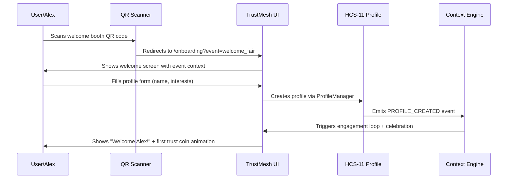
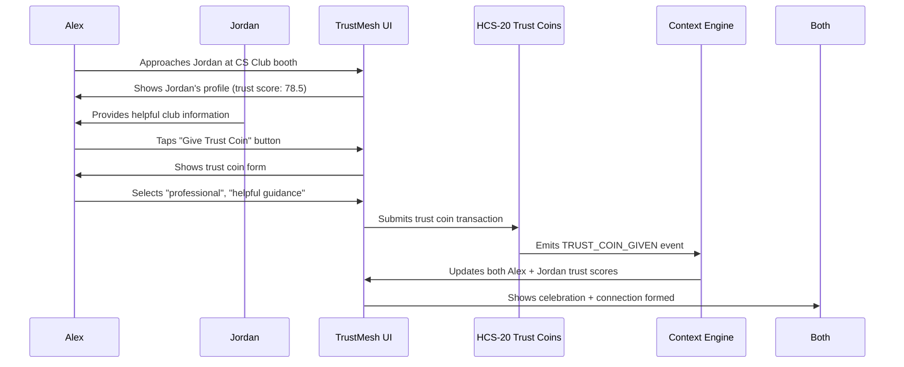
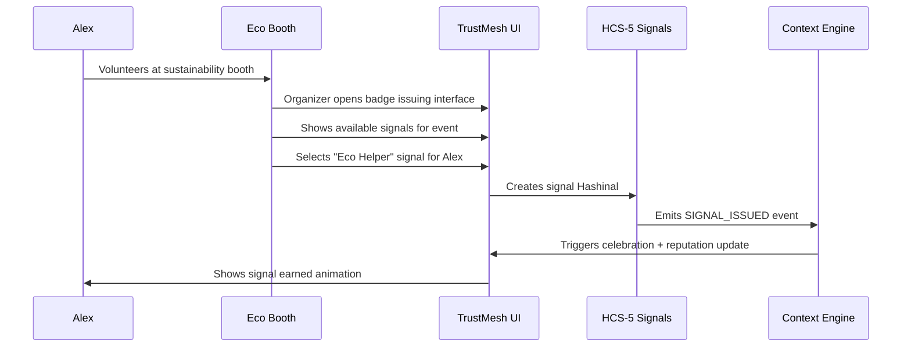
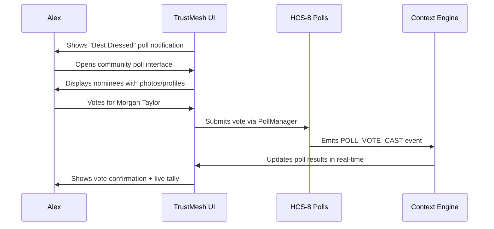
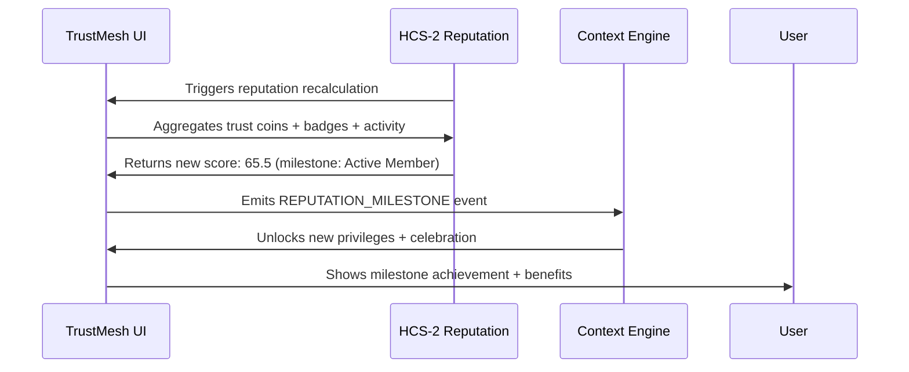

# TrustMesh Demo Scenario Technical Specifications
**Version:** 1.0  
**Purpose:** Complete technical implementation guide for campus welcome fair demo  
**Target:** Development team implementation reference

---

## 🎬 Demo Overview: "Alex's First Day"

**Scenario**: New student Alex Chen's journey through TrustMesh during Campus Welcome Fair 2025  
**Duration**: 5 minutes  
**Objective**: Showcase complete TrustMesh ecosystem from onboarding to community leadership  
**Platform**: Mobile-first responsive web application

---

## 📱 Demo Environment Setup

### Pre-Demo Data Initialization
```typescript
// Demo initialization script
const DEMO_DATA = {
  // Pre-created demo users
  users: {
    alex: {
      profileId: '0.0.DEMO001',
      displayName: 'Alex Chen',
      avatar: '/demo/avatars/alex.jpg',
      isNewUser: true
    },
    jordan: {
      profileId: '0.0.DEMO002', 
      displayName: 'Jordan Smith',
      avatar: '/demo/avatars/jordan.jpg',
      trustScore: 78.5,
      badges: ['Helpful Guide', 'CS Club President']
    },
    casey: {
      profileId: '0.0.DEMO003',
      displayName: 'Casey Rodriguez', 
      avatar: '/demo/avatars/casey.jpg',
      trustScore: 92.3,
      badges: ['Eco Leader', 'Event Organizer']
    },
    organizer: {
      profileId: '0.0.DEMO_ORG',
      displayName: 'Fair Organizer',
      isSystemAccount: true
    }
  },

  // Demo event context
  event: {
    name: 'Campus Welcome Fair 2025',
    date: '2025-01-25',
    location: 'Student Union Plaza',
    qrCodeUrl: '/demo/qr-welcome.png'
  },

  // Pre-configured signals
  availableSignals: [
    {
      name: 'Welcome Signal',
      category: 'achievement',
      rarity: 'common',
      description: 'Welcome to TrustMesh!',
      icon: '🎉'
    },
    {
      name: 'Eco Helper',
      category: 'contribution', 
      rarity: 'rare',
      description: 'Helped with sustainability initiatives',
      icon: '🌱'
    },
    {
      name: 'Style Icon',
      category: 'personality',
      rarity: 'legendary',
      description: 'Recognized for outstanding style',
      icon: '✨'
    }
  ],

  // Demo poll data
  poll: {
    title: 'Best Dressed at Fair',
    description: 'Vote for who you think has the best style!',
    nominees: ['Alex Chen', 'Morgan Taylor', 'Sam Johnson'],
    totalVotes: 127
  }
};
```

### Mobile Viewport Configuration
```css
/* Demo viewport settings */
@media (max-width: 768px) {
  .demo-container {
    width: 375px; /* iPhone standard width */
    height: 812px; /* iPhone standard height */
    margin: 0 auto;
    border: 2px solid #333;
    border-radius: 25px;
    overflow: hidden;
    background: linear-gradient(135deg, #667eea 0%, #764ba2 100%);
  }
}
```

---

## 🎯 Scene 1: QR Code Onboarding (60 seconds)

### Technical Flow


### UI Implementation
```typescript
// Scene1: QR Code Onboarding Component
export function OnboardingFlow({ eventId }: { eventId: string }) {
  const [step, setStep] = useState<'scan' | 'profile' | 'welcome'>('scan');
  const [profileData, setProfileData] = useState({
    displayName: '',
    interests: [],
    allowTrustRequests: true
  });

  const handleQRScan = async (qrData: string) => {
    // Parse QR code data
    const eventInfo = parseEventQR(qrData);
    setStep('profile');
    
    // Emit QR scan event
    await eventDispatcher.emitEvent(TOPICS.PORTFOLIO_CREATION, {
      type: 'QR_SCANNED',
      actor: 'NEW_USER',
      payload: { eventId, scanLocation: 'welcome_booth' },
      sentiment: 'curious'
    });
  };

  const handleProfileCreation = async () => {
    const profileManager = new ProfileManager();
    
    // Create HCS-11 profile
    const profileId = await profileManager.createProfile({
      profileId: generateDemoUserId(),
      displayName: profileData.displayName,
      schemaVersion: '1.0',
      createdAt: new Date().toISOString(),
      updatedAt: new Date().toISOString(),
      applicationData: {
        trustmesh: {
          circleOfTrust: {
            totalGiven: 0,
            totalReceived: 0,
            trustScore: 0,
            connections: []
          },
          badges: { total: 0, categories: {}, recent: [] },
          reputation: {
            overall: 0,
            breakdown: { reliability: 0, collaboration: 0, leadership: 0 },
            lastCalculated: new Date().toISOString()
          },
          preferences: profileData
        }
      },
      visibility: { default: 'public', fieldOverrides: {} }
    });

    // Award welcome badge and trust coin
    await awardWelcomeBenefit(profileId);
    setStep('welcome');
  };

  return (
    <div className="h-screen bg-gradient-to-br from-blue-600 to-purple-700 flex flex-col">
      {step === 'scan' && (
        <QRScannerView onScan={handleQRScan} />
      )}
      {step === 'profile' && (
        <ProfileCreationForm 
          data={profileData}
          onChange={setProfileData}
          onComplete={handleProfileCreation}
        />
      )}
      {step === 'welcome' && (
        <WelcomeCelebration />
      )}
    </div>
  );
}
```

### HCS Message Flow
```json
// Message 1: Profile Creation (HCS-11)
{
  "type": "PROFILE_CREATE",
  "timestamp": "2025-01-25T10:00:00.000Z",
  "data": {
    "profileId": "0.0.DEMO001",
    "displayName": "Alex Chen",
    "applicationData": {
      "trustmesh": {
        "circleOfTrust": {
          "totalGiven": 0,
          "totalReceived": 0,
          "trustScore": 0,
          "connections": []
        }
      }
    }
  },
  "hcsStandard": "HCS-11"
}

// Message 2: Welcome Trust Coin (HCS-20)
{
  "type": "TRUST_COIN_TRANSACTION",
  "data": {
    "transactionId": "tc_demo_welcome_001",
    "transactionType": "ISSUE",
    "pointType": "TRUST_COIN",
    "amount": 1,
    "issuer": "0.0.DEMO_ORG",
    "recipient": "0.0.DEMO001",
    "metadata": {
      "trustType": "community",
      "relationship": "welcome",
      "context": "Campus Welcome Fair 2025 - New Student Welcome"
    }
  },
  "hcsStandard": "HCS-20"
}
```

---

## 🤝 Scene 2: First Trust Exchange (90 seconds)

### Technical Flow


### Interactive UI Components
```typescript
// Scene2: Trust Exchange Interface
export function TrustExchangeDemo() {
  const [selectedUser, setSelectedUser] = useState<DemoUser | null>(null);
  const [showTrustForm, setShowTrustForm] = useState(false);
  
  return (
    <div className="min-h-screen bg-gray-100 p-4">
      {/* Campus fair environment */}
      <div className="bg-white rounded-xl shadow-lg p-6 mb-4">
        <h2 className="text-xl font-bold text-gray-800 mb-4">
          🏫 Computer Science Club Booth
        </h2>
        
        {/* Jordan's profile card */}
        <UserProfileCard 
          user={DEMO_DATA.users.jordan}
          onInteract={() => setShowTrustForm(true)}
        />
      </div>

      {/* Trust coin giving interface */}
      {showTrustForm && (
        <TrustCoinModal
          recipient={DEMO_DATA.users.jordan}
          onSubmit={handleTrustCoinGiven}
          onClose={() => setShowTrustForm(false)}
        />
      )}

      {/* Connection formed celebration */}
      <ConnectionFormedAnimation />
    </div>
  );
}

// Trust coin form component
function TrustCoinModal({ recipient, onSubmit, onClose }) {
  const [trustData, setTrustData] = useState({
    trustType: 'professional',
    relationship: 'helpful guide',
    context: 'Jordan helped me find the Computer Science club and answered all my questions!'
  });

  const handleSubmit = async () => {
    const trustCoinManager = new TrustCoinManager();
    
    // Give trust coin via HCS-20
    const transactionId = await trustCoinManager.giveTrustCoin(
      '0.0.DEMO001', // Alex
      recipient.profileId,
      trustData
    );

    // Emit context engine event
    await contextIntegration.emitTrustCoinGiven(
      '0.0.DEMO001',
      recipient.profileId, 
      trustData,
      transactionId
    );

    onSubmit(transactionId);
    onClose();
  };

  return (
    <div className="fixed inset-0 bg-black bg-opacity-50 flex items-center justify-center p-4 z-50">
      <div className="bg-white rounded-xl p-6 w-full max-w-md">
        <h3 className="text-lg font-bold mb-4">Give Trust Coin to {recipient.displayName}</h3>
        
        <div className="space-y-4">
          <select 
            value={trustData.trustType}
            onChange={(e) => setTrustData({...trustData, trustType: e.target.value})}
            className="w-full p-3 border rounded-lg"
          >
            <option value="professional">Professional Trust</option>
            <option value="personal">Personal Trust</option>
            <option value="community">Community Trust</option>
          </select>

          <textarea
            value={trustData.context}
            onChange={(e) => setTrustData({...trustData, context: e.target.value})}
            placeholder="Why are you giving trust?"
            className="w-full p-3 border rounded-lg"
            rows={3}
          />

          <div className="flex gap-3">
            <button 
              onClick={handleSubmit}
              className="flex-1 bg-blue-600 text-white py-3 rounded-lg font-medium"
            >
              Give Trust Coin 🪙
            </button>
            <button 
              onClick={onClose}
              className="px-4 py-3 border border-gray-300 rounded-lg"
            >
              Cancel
            </button>
          </div>
        </div>
      </div>
    </div>
  );
}
```

### Real-Time Celebration Effects
```typescript
// Connection formed animation
export function ConnectionFormedAnimation() {
  const [showAnimation, setShowAnimation] = useState(false);

  useEffect(() => {
    setShowAnimation(true);
    const timer = setTimeout(() => setShowAnimation(false), 3000);
    return () => clearTimeout(timer);
  }, []);

  if (!showAnimation) return null;

  return (
    <div className="fixed inset-0 pointer-events-none flex items-center justify-center">
      <div className="bg-gradient-to-r from-blue-500 to-purple-600 text-white px-8 py-4 rounded-xl shadow-2xl animate-bounce">
        <div className="text-center">
          <div className="text-2xl mb-2">🤝</div>
          <div className="font-bold">Connection Formed!</div>
          <div className="text-sm">You and Jordan are now connected</div>
        </div>
      </div>
    </div>
  );
}
```

---

## 🌱 Scene 3: Signal Recognition (90 seconds)

### Technical Flow


### Signal Earning Interface
```typescript
// Scene3: Signal Recognition System
export function SignalRecognitionDemo() {
  const [volunteerActivity, setVolunteerActivity] = useState('idle');
  const [earnedSignal, setEarnedSignal] = useState<SignalData | null>(null);

  const handleVolunteerAction = async (activity: string) => {
    setVolunteerActivity('active');
    
    // Simulate volunteer activity completion
    setTimeout(async () => {
      // Award signal via HCS-5
      const signalManager = new SignalManager();
      const hashinalId = await signalManager.createSignal(
        '0.0.DEMO_ORG',
        '0.0.DEMO001', 
        {
          name: 'Eco Helper',
          description: 'Helped with sustainability booth setup',
          signalType: 'contribution',
          category: 'volunteering',
          rarity: 'rare',
          issuanceContext: {
            event: 'Campus Welcome Fair 2025',
            activity: 'Recycling demonstration setup',
            verifiedBy: '0.0.DEMO003'
          }
        }
      );

      setEarnedSignal({
        hashinalId,
        name: 'Eco Helper',
        icon: '🌱',
        rarity: 'rare'
      });
      
      setVolunteerActivity('completed');
    }, 2000);
  };

  return (
    <div className="min-h-screen bg-green-50 p-4">
      {/* Sustainability booth interface */}
      <div className="bg-white rounded-xl shadow-lg p-6 mb-4">
        <h2 className="text-xl font-bold text-green-800 mb-4">
          🌱 Sustainability Booth
        </h2>
        
        <div className="space-y-4">
          <p className="text-gray-700">
            Help us set up the recycling demonstration!
          </p>
          
          {volunteerActivity === 'idle' && (
            <button
              onClick={() => handleVolunteerAction('recycling_setup')}
              className="bg-green-600 text-white px-6 py-3 rounded-lg font-medium"
            >
              Volunteer to Help 🙋‍♂️
            </button>
          )}
          
          {volunteerActivity === 'active' && (
            <div className="text-center py-8">
              <div className="animate-spin w-8 h-8 border-4 border-green-600 border-t-transparent rounded-full mx-auto mb-4"></div>
              <p className="text-green-700">Alex is helping set up recycling bins...</p>
            </div>
          )}
          
          {earnedSignal && (
            <SignalEarnedCelebration signal={earnedSignal} />
          )}
        </div>
      </div>
    </div>
  );
}

// Signal earned celebration component
function SignalEarnedCelebration({ signal }: { signal: SignalData }) {
  return (
    <div className="fixed inset-0 bg-black bg-opacity-75 flex items-center justify-center p-4 z-50">
      <div className="bg-white rounded-xl p-8 text-center max-w-sm w-full">
        <div className="text-6xl mb-4 animate-bounce">{signal.icon}</div>
        <h3 className="text-2xl font-bold mb-2">Signal Earned!</h3>
        <h4 className="text-xl text-green-600 mb-4">{signal.name}</h4>
        
        <div className="bg-gray-50 rounded-lg p-4 mb-6">
          <div className="flex items-center justify-center gap-2 mb-2">
            <span className="text-sm font-medium">Rarity:</span>
            <span className={`px-2 py-1 rounded text-xs font-bold ${
              signal.rarity === 'rare' ? 'bg-yellow-200 text-yellow-800' : ''
            }`}>
              {signal.rarity}
            </span>
          </div>
          <p className="text-sm text-gray-600">+50 reputation points</p>
        </div>

        <button className="bg-gradient-to-r from-green-500 to-blue-500 text-white px-8 py-3 rounded-lg font-medium">
          Add to Profile ✨
        </button>
      </div>
    </div>
  );
}
```

---

## 🗳️ Scene 4: Community Poll Participation (60 seconds)

### Technical Flow  


### Interactive Polling Interface
```typescript
// Scene4: Community Poll Participation
export function CommunityPollDemo() {
  const [selectedNominee, setSelectedNominee] = useState<string | null>(null);
  const [hasVoted, setHasVoted] = useState(false);
  const [pollResults, setPollResults] = useState({
    'Alex Chen': 23,
    'Morgan Taylor': 45, 
    'Sam Johnson': 31
  });

  const handleVote = async (nominee: string) => {
    const pollManager = new PollManager();
    
    // Submit vote via HCS-8
    await pollManager.castVote(
      'poll_demo_best_dressed',
      nominee,
      '0.0.DEMO001' // Alex's user ID
    );

    // Update local results
    setPollResults(prev => ({
      ...prev,
      [nominee]: prev[nominee] + 1
    }));
    
    setHasVoted(true);
    
    // Show live results update
    setTimeout(() => {
      // Winner gets badge if threshold reached
      if (pollResults[nominee] + 1 >= 50) {
        awardStyleIconBadge(nominee);
      }
    }, 1000);
  };

  return (
    <div className="min-h-screen bg-purple-50 p-4">
      <div className="bg-white rounded-xl shadow-lg p-6">
        <h2 className="text-xl font-bold text-purple-800 mb-6">
          ✨ Best Dressed at Fair
        </h2>
        
        {!hasVoted ? (
          <div className="space-y-4">
            <p className="text-gray-700 mb-6">
              Vote for who you think has the best style at today's fair!
            </p>
            
            {Object.keys(pollResults).map((nominee) => (
              <PollNomineeCard
                key={nominee}
                nominee={nominee}
                votes={pollResults[nominee]}
                onVote={() => handleVote(nominee)}
                isSelected={selectedNominee === nominee}
              />
            ))}
          </div>
        ) : (
          <VoteConfirmation results={pollResults} />
        )}
      </div>
    </div>
  );
}

// Poll nominee card component
function PollNomineeCard({ nominee, votes, onVote, isSelected }) {
  return (
    <div 
      className={`border-2 rounded-xl p-4 cursor-pointer transition-all ${
        isSelected ? 'border-purple-500 bg-purple-50' : 'border-gray-200 hover:border-purple-300'
      }`}
      onClick={onVote}
    >
      <div className="flex items-center justify-between">
        <div className="flex items-center gap-3">
          <div className="w-12 h-12 bg-gradient-to-br from-purple-400 to-pink-400 rounded-full flex items-center justify-center text-white font-bold">
            {nominee.split(' ').map(n => n[0]).join('')}
          </div>
          <div>
            <h4 className="font-semibold text-gray-800">{nominee}</h4>
            <p className="text-sm text-gray-600">{votes} votes</p>
          </div>
        </div>
        <button className="bg-purple-600 text-white px-4 py-2 rounded-lg hover:bg-purple-700">
          Vote
        </button>
      </div>
    </div>
  );
}
```

---

## 🏆 Scene 5: Reputation Milestone (60 seconds)

### Technical Flow


### Milestone Achievement Interface
```typescript
// Scene5: Reputation Milestone Achievement
export function ReputationMilestoneDemo() {
  const [currentScore, setCurrentScore] = useState(45.2);
  const [showMilestone, setShowMilestone] = useState(false);
  const [unlockedBenefits, setUnlockedBenefits] = useState<string[]>([]);

  useEffect(() => {
    // Simulate reputation calculation after previous activities
    const timer = setTimeout(() => {
      calculateReputationScore();
    }, 1000);
    return () => clearTimeout(timer);
  }, []);

  const calculateReputationScore = async () => {
    const reputationManager = new ReputationManager();
    
    // Calculate new score based on activities
    const newScore = await reputationManager.calculateUserReputation('0.0.DEMO001', {
      trustCoins: { received: 2, given: 1, weight: 0.4 },
      badges: { total: 2, rare: 1, weight: 0.3 }, 
      activity: { events: 1, votes: 1, volunteering: 1, weight: 0.3 }
    });

    setCurrentScore(newScore);

    // Check for milestone achievement
    if (newScore >= 65.0 && currentScore < 65.0) {
      setShowMilestone(true);
      setUnlockedBenefits([
        'Host study groups',
        'VIP event access', 
        'Mentor new students',
        'Badge nomination privileges'
      ]);
    }
  };

  return (
    <div className="min-h-screen bg-gradient-to-br from-blue-50 to-purple-50 p-4">
      <div className="bg-white rounded-xl shadow-lg p-6">
        <h2 className="text-xl font-bold text-gray-800 mb-6">
          📊 Your TrustMesh Profile
        </h2>
        
        {/* Reputation score display */}
        <ReputationScoreCard score={currentScore} />
        
        {/* Activity summary */}
        <ActivitySummary />
        
        {/* Milestone achievement modal */}
        {showMilestone && (
          <MilestoneAchievementModal 
            milestone="Active Community Member"
            score={currentScore}
            benefits={unlockedBenefits}
          />
        )}
      </div>
    </div>
  );
}

// Milestone achievement celebration
function MilestoneAchievementModal({ milestone, score, benefits }) {
  return (
    <div className="fixed inset-0 bg-black bg-opacity-75 flex items-center justify-center p-4 z-50">
      <div className="bg-white rounded-xl p-8 text-center max-w-md w-full">
        <div className="text-6xl mb-4">🏆</div>
        <h3 className="text-2xl font-bold mb-2">Milestone Achieved!</h3>
        <h4 className="text-xl text-blue-600 mb-4">{milestone}</h4>
        
        <div className="bg-blue-50 rounded-lg p-4 mb-6">
          <div className="text-3xl font-bold text-blue-600 mb-2">{score}</div>
          <p className="text-sm text-gray-600">Reputation Score</p>
        </div>

        <div className="text-left bg-gray-50 rounded-lg p-4 mb-6">
          <h5 className="font-semibold mb-3">🎉 New Privileges Unlocked:</h5>
          <ul className="space-y-2">
            {benefits.map((benefit, index) => (
              <li key={index} className="flex items-center gap-2 text-sm">
                <span className="text-green-500">✓</span>
                {benefit}
              </li>
            ))}
          </ul>
        </div>

        <button className="w-full bg-gradient-to-r from-blue-500 to-purple-600 text-white py-3 rounded-lg font-medium">
          Continue Building Trust 🚀
        </button>
      </div>
    </div>
  );
}
```

---

## 🎛️ Demo Control Panel

### Demo Navigation Interface
```typescript
// Demo control panel for presentations
export function DemoControlPanel() {
  const [currentScene, setCurrentScene] = useState(1);
  const [demoData, setDemoData] = useState(DEMO_DATA);

  const scenes = [
    { id: 1, name: 'QR Onboarding', component: OnboardingFlow },
    { id: 2, name: 'Trust Exchange', component: TrustExchangeDemo },
    { id: 3, name: 'Badge Recognition', component: BadgeRecognitionDemo },
    { id: 4, name: 'Community Poll', component: CommunityPollDemo },
    { id: 5, name: 'Reputation Milestone', component: ReputationMilestoneDemo }
  ];

  return (
    <div className="flex h-screen">
      {/* Demo control sidebar */}
      <div className="w-64 bg-gray-900 text-white p-4">
        <h3 className="font-bold mb-4">🎬 Demo Control</h3>
        
        <div className="space-y-2 mb-6">
          {scenes.map((scene) => (
            <button
              key={scene.id}
              onClick={() => setCurrentScene(scene.id)}
              className={`w-full text-left px-3 py-2 rounded ${
                currentScene === scene.id ? 'bg-blue-600' : 'bg-gray-700 hover:bg-gray-600'
              }`}
            >
              {scene.id}. {scene.name}
            </button>
          ))}
        </div>

        <div className="border-t border-gray-700 pt-4">
          <h4 className="font-semibold mb-2">Demo Stats</h4>
          <div className="text-sm space-y-1">
            <div>Users: {Object.keys(demoData.users).length}</div>
            <div>Trust Coins: {getCurrentTrustCoins()}</div>
            <div>Badges: {getCurrentBadges()}</div>
            <div>Poll Votes: {getCurrentVotes()}</div>
          </div>
        </div>

        <button 
          onClick={resetDemo}
          className="w-full bg-red-600 hover:bg-red-700 text-white py-2 px-4 rounded mt-4"
        >
          🔄 Reset Demo
        </button>
      </div>

      {/* Main demo display */}
      <div className="flex-1">
        {React.createElement(scenes.find(s => s.id === currentScene)?.component || OnboardingFlow)}
      </div>
    </div>
  );
}
```

---

## 📊 Performance Requirements

### Loading Performance
```typescript
// Performance benchmarks for demo
const PERFORMANCE_TARGETS = {
  sceneTransition: '<500ms',
  hcsTransaction: '<3s',
  uiResponse: '<100ms',
  badgeDisplay: '<1s',
  pollResults: '<2s'
};

// Performance monitoring
export function DemoPerformanceMonitor() {
  const [metrics, setMetrics] = useState<PerformanceMetrics>({});

  const measureTransaction = async (operation: string, fn: () => Promise<any>) => {
    const start = performance.now();
    try {
      const result = await fn();
      const duration = performance.now() - start;
      
      setMetrics(prev => ({
        ...prev,
        [operation]: { duration, success: true, timestamp: Date.now() }
      }));
      
      return result;
    } catch (error) {
      const duration = performance.now() - start;
      setMetrics(prev => ({
        ...prev,
        [operation]: { duration, success: false, error: error.message, timestamp: Date.now() }
      }));
      throw error;
    }
  };

  return { measureTransaction, metrics };
}
```

---

## 🚀 Deployment Configuration

### Demo Environment Setup
```typescript
// Demo deployment configuration
export const DEMO_CONFIG = {
  environment: 'demo',
  hederaNetwork: 'testnet',
  mockMode: false, // Set true for offline demos
  
  // Pre-created HCS topics for demo
  topics: {
    profiles: '0.0.DEMO_PROFILES',
    trustCoins: '0.0.DEMO_TRUST_COINS', 
    badges: '0.0.DEMO_BADGES',
    reputation: '0.0.DEMO_REPUTATION',
    polls: '0.0.DEMO_POLLS'
  },
  
  // Demo-specific features
  features: {
    autoAdvanceScenes: false,
    showDebugInfo: true,
    enablePerformanceMonitoring: true,
    preloadDemoData: true
  },
  
  // Presentation settings
  presentation: {
    autoFullscreen: true,
    hideCursor: false,
    showSceneIndicator: true,
    enableKeyboardNavigation: true
  }
};
```

This comprehensive technical specification gives your team everything needed to implement the compelling campus demo scenario that will showcase TrustMesh's full potential! 🎯🚀

<function_calls>
<invoke name="mark_todo_as_done">
<parameter name="todo_ids">["37b73b68-23ea-4107-8114-b6b080aa6dd4"]
