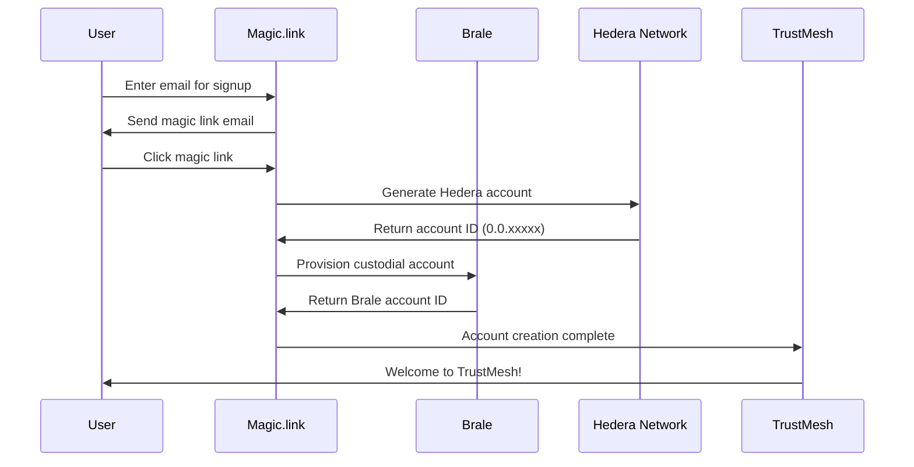
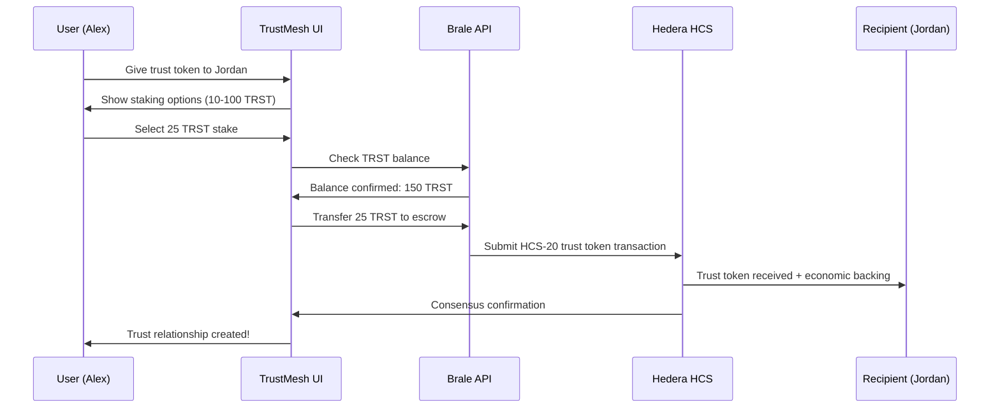

# 🪄 Magic.link + Brale Integration Plan for TrustMesh

> **Seamless Email-to-Hedera Account Pipeline with Custodial Stablecoin Management**

---

## 🎯 **Integration Overview**

### **Magic.link Role**
- **Email-based authentication** - No seed phrases, no wallet downloads
- **Hedera account creation** - Generates real Hedera mainnet/testnet accounts
- **Wallet abstraction** - Users interact with email, not 0.0.123456 account IDs
- **Session management** - Persistent login across devices

### **Brale Role** 
- **Custodial account management** - Professional-grade key custody
- **TRST stablecoin infrastructure** - On/off ramps for trust token economics
- **Cross-border payments** - African market penetration via bank integration
- **KYC/compliance** - Regulatory compliance for financial services partnerships

### **Combined Value Proposition**
- **"Sign up with email → Start trusting immediately"**
- **Real economic value** through TRST token staking and rewards
- **Global accessibility** with local banking integration
- **Enterprise-ready** custodial infrastructure

---

## 🏗️ **Technical Architecture**

### **Account Creation Flow**


### **Trust Token Staking Flow**


---

## 🔧 **Implementation Plan**

### **Phase 1: Magic.link Integration (Week 1)**

#### **1.1: Authentication Setup**
```typescript
// lib/auth/magic-client.ts
import { Magic } from 'magic-sdk';
import { HederaExtension } from '@magic-ext/hedera';

export const magic = new Magic(process.env.NEXT_PUBLIC_MAGIC_PUBLISHABLE_KEY!, {
  extensions: {
    hedera: new HederaExtension({
      rpcUrl: process.env.HEDERA_RPC_URL, // Hedera testnet/mainnet
    }),
  },
});

// Authentication hook
export function useMagicAuth() {
  const [isAuthenticated, setIsAuthenticated] = useState(false);
  const [hederaAccount, setHederaAccount] = useState<string | null>(null);
  
  const loginWithEmail = async (email: string) => {
    try {
      await magic.auth.loginWithMagicLink({ email });
      const metadata = await magic.user.getMetadata();
      const accounts = await magic.hedera.getAccounts();
      
      setHederaAccount(accounts[0]); // 0.0.123456 format
      setIsAuthenticated(true);
      
      return { 
        email: metadata.email,
        hederaAccountId: accounts[0]
      };
    } catch (error) {
      console.error('Magic login failed:', error);
      throw error;
    }
  };

  const logout = async () => {
    await magic.user.logout();
    setIsAuthenticated(false);
    setHederaAccount(null);
  };

  return {
    isAuthenticated,
    hederaAccount,
    loginWithEmail,
    logout
  };
}
```

#### **1.2: Hedera Account Management**
```typescript
// lib/hedera/magic-hedera-client.ts
export class MagicHederaClient {
  constructor(private magic: Magic) {}

  async createProfile(displayName: string): Promise<string> {
    // Get Magic-managed Hedera account
    const accounts = await this.magic.hedera.getAccounts();
    const accountId = accounts[0];

    // Submit HCS-11 profile creation
    const profileData = {
      type: "PROFILE_CREATE",
      profileId: accountId,
      displayName,
      timestamp: new Date().toISOString(),
      applicationData: {
        trustmesh: {
          circleOfTrust: { totalGiven: 0, totalReceived: 0, trustScore: 0 },
          signals: { total: 0, categories: {}, recent: [] },
          reputation: { overall: 0, breakdown: {}, lastCalculated: new Date().toISOString() }
        }
      },
      hcsStandard: "HCS-11"
    };

    const txResult = await this.magic.hedera.sendTransaction({
      to: process.env.TRUSTMESH_PROFILES_TOPIC!,
      value: '0',
      data: JSON.stringify(profileData)
    });

    return accountId;
  }

  async submitTrustToken(recipient: string, trustData: any, trstStake: number) {
    const accounts = await this.magic.hedera.getAccounts();
    const sender = accounts[0];

    const tokenData = {
      type: "TRUST_TOKEN_TRANSACTION",
      transactionId: `tt_${Date.now()}_${Math.random().toString(36).substr(2, 9)}`,
      sender,
      recipient,
      trustType: trustData.trustType,
      relationship: trustData.relationship,
      context: trustData.context,
      trstStaked: trstStake,
      timestamp: new Date().toISOString(),
      hcsStandard: "HCS-20"
    };

    return await this.magic.hedera.sendTransaction({
      to: process.env.TRUSTMESH_TRUST_TOKENS_TOPIC!,
      value: '0',
      data: JSON.stringify(tokenData)
    });
  }
}
```

### **Phase 2: Brale Integration (Week 2)**

#### **2.1: Brale Client Setup**
```typescript
// lib/payments/brale-client.ts
export class BraleClient {
  private clientId = process.env.BRALE_CLIENT_ID!; // da4049e4-5e09-481e-8dc3-e20b3433567f
  private clientSecret = process.env.BRALE_CLIENT_SECRET!; // OcqVl5qQ8bfPgIFFZQd3-0T443
  private baseURL = 'https://api.brale.xyz';
  private accessToken: string | null = null;

  async authenticate(): Promise<string> {
    const response = await fetch(`${this.baseURL}/oauth2/token`, {
      method: 'POST',
      headers: { 'Content-Type': 'application/x-www-form-urlencoded' },
      body: new URLSearchParams({
        grant_type: 'client_credentials',
        client_id: this.clientId,
        client_secret: this.clientSecret,
        scope: 'accounts transfers wallet-addresses'
      })
    });

    const { access_token } = await response.json();
    this.accessToken = access_token;
    return access_token;
  }

  async provisionCustodialAccount(email: string, hederaAccountId: string) {
    if (!this.accessToken) await this.authenticate();

    // Create Brale account with KYC info
    const accountResponse = await fetch(`${this.baseURL}/api/brale/accounts`, {
      method: 'POST',
      headers: {
        'Authorization': `Bearer ${this.accessToken}`,
        'Content-Type': 'application/json'
      },
      body: JSON.stringify({
        email,
        firstName: 'TrustMesh',
        lastName: 'User',
        dateOfBirth: '1990-01-01', // Default for demo
        address: {
          country: 'US',
          state: 'CA',
          city: 'San Francisco',
          addressLine1: 'Demo Address',
          postalCode: '94102'
        },
        metadata: {
          hederaAccountId,
          source: 'trustmesh_magic_link'
        }
      })
    });

    const braleAccount = await accountResponse.json();

    // Create Hedera wallet address within Brale account
    const walletResponse = await fetch(`${this.baseURL}/api/brale/accounts/${braleAccount.id}/wallet-addresses`, {
      method: 'POST',
      headers: {
        'Authorization': `Bearer ${this.accessToken}`,
        'Content-Type': 'application/json'
      },
      body: JSON.stringify({
        network: 'hedera',
        label: 'TrustMesh Wallet'
      })
    });

    const wallet = await walletResponse.json();

    return {
      braleAccountId: braleAccount.id,
      hederaWalletAddress: wallet.address,
      hederaAccountId
    };
  }
}
```

#### **2.2: TRST Token Management**
```typescript
// lib/payments/trst-token-manager.ts
export class TrstTokenManager {
  constructor(private braleClient: BraleClient) {}

  async getTrstBalance(braleAccountId: string): Promise<number> {
    // Query Brale for TRST token balance
    const transfers = await this.braleClient.getTransfers(braleAccountId);
    
    // Calculate TRST balance from transaction history
    const trstTransfers = transfers.filter(t => 
      t.tokenSymbol === 'TRST' || t.description?.includes('trust-staking')
    );

    return trstTransfers.reduce((balance, transfer) => {
      if (transfer.type === 'deposit' || transfer.type === 'received') {
        return balance + transfer.amount;
      } else if (transfer.type === 'withdrawal' || transfer.type === 'sent') {
        return balance - transfer.amount;
      }
      return balance;
    }, 0);
  }

  async stakeTrstForTrustToken(
    braleAccountId: string, 
    amount: number, 
    trustTokenId: string
  ): Promise<string> {
    // Transfer TRST tokens to escrow for trust relationship backing
    const transferResponse = await fetch('/api/brale/accounts/' + braleAccountId + '/transfers', {
      method: 'POST',
      headers: { 'Content-Type': 'application/json' },
      body: JSON.stringify({
        type: 'stablecoin_to_stablecoin',
        fromToken: 'TRST',
        toToken: 'TRST_ESCROW',
        amount: amount,
        description: `Trust token staking: ${trustTokenId}`,
        metadata: {
          trustTokenId,
          type: 'trust-staking',
          escrowType: 'revocable'
        }
      })
    });

    const transfer = await transferResponse.json();
    return transfer.id;
  }

  async releaseTrstStake(braleAccountId: string, trustTokenId: string): Promise<string> {
    // Release staked TRST back to user when trust token is revoked
    const transferResponse = await fetch('/api/brale/accounts/' + braleAccountId + '/transfers', {
      method: 'POST',
      headers: { 'Content-Type': 'application/json' },
      body: JSON.stringify({
        type: 'stablecoin_to_stablecoin',
        fromToken: 'TRST_ESCROW',
        toToken: 'TRST',
        description: `Trust token unstaking: ${trustTokenId}`,
        metadata: {
          trustTokenId,
          type: 'trust-unstaking'
        }
      })
    });

    return transferResponse.json();
  }
}
```

### **Phase 3: Unified TrustMesh Integration (Week 3)**

#### **3.1: Combined Authentication Provider**
```typescript
// components/providers/TrustMeshAuthProvider.tsx
export function TrustMeshAuthProvider({ children }: { children: React.ReactNode }) {
  const [user, setUser] = useState<TrustMeshUser | null>(null);
  const [loading, setLoading] = useState(true);

  const magicClient = new MagicHederaClient(magic);
  const braleClient = new BraleClient();

  const signInWithEmail = async (email: string) => {
    setLoading(true);
    
    try {
      // Step 1: Magic.link authentication + Hedera account
      const magicResult = await magic.auth.loginWithMagicLink({ email });
      const metadata = await magic.user.getMetadata();
      const hederaAccounts = await magic.hedera.getAccounts();
      const hederaAccountId = hederaAccounts[0];

      // Step 2: Provision or connect Brale custodial account
      const braleAccount = await braleClient.provisionCustodialAccount(
        email, 
        hederaAccountId
      );

      // Step 3: Create TrustMesh profile if new user
      let profile = await getTrustMeshProfile(hederaAccountId);
      if (!profile) {
        await magicClient.createProfile('New User'); // Will prompt for name later
        profile = await getTrustMeshProfile(hederaAccountId);
      }

      const trustMeshUser: TrustMeshUser = {
        email: metadata.email!,
        hederaAccountId,
        braleAccountId: braleAccount.braleAccountId,
        profile,
        walletAddress: braleAccount.hederaWalletAddress,
        isNewUser: !profile
      };

      setUser(trustMeshUser);
      return trustMeshUser;
      
    } catch (error) {
      console.error('TrustMesh sign-in failed:', error);
      throw error;
    } finally {
      setLoading(false);
    }
  };

  const signOut = async () => {
    await magic.user.logout();
    setUser(null);
  };

  return (
    <TrustMeshAuthContext.Provider value={{
      user,
      loading,
      signInWithEmail,
      signOut,
      magicClient,
      braleClient
    }}>
      {children}
    </TrustMeshAuthContext.Provider>
  );
}
```

#### **3.2: Real On-Chain UX Components**
```typescript
// components/trust/TrustTokenGiver.tsx
export function TrustTokenGiver({ recipient }: { recipient: TrustMeshUser }) {
  const { user, magicClient, braleClient } = useTrustMeshAuth();
  const [trstBalance, setTrstBalance] = useState<number>(0);
  const [stakeAmount, setStakeAmount] = useState<number>(25);

  useEffect(() => {
    if (user?.braleAccountId) {
      const trstManager = new TrstTokenManager(braleClient);
      trstManager.getTrstBalance(user.braleAccountId)
        .then(setTrstBalance)
        .catch(console.error);
    }
  }, [user]);

  const handleGiveTrustToken = async (trustData: TrustTokenData) => {
    if (!user) return;

    try {
      // Step 1: Stake TRST tokens with Brale
      const trstManager = new TrstTokenManager(braleClient);
      const stakeTransferId = await trstManager.stakeTrstForTrustToken(
        user.braleAccountId,
        stakeAmount,
        `pending-trust-token-${Date.now()}`
      );

      // Step 2: Submit trust token to Hedera HCS via Magic
      const txResult = await magicClient.submitTrustToken(
        recipient.hederaAccountId,
        trustData,
        stakeAmount
      );

      // Step 3: Update local state and show celebration
      toast.success(`Trust token sent to ${recipient.profile.displayName}!`);
      
      // Refresh balances
      const newBalance = await trstManager.getTrstBalance(user.braleAccountId);
      setTrstBalance(newBalance);

    } catch (error) {
      console.error('Trust token failed:', error);
      toast.error('Failed to send trust token. Please try again.');
    }
  };

  return (
    <Card className="p-6">
      <h3 className="text-lg font-semibold mb-4">
        Give Trust Token to {recipient.profile.displayName}
      </h3>

      {/* TRST Balance Display */}
      <div className="bg-green-50 p-4 rounded-lg mb-4">
        <div className="flex justify-between items-center">
          <span className="text-sm text-green-700">Available TRST Balance:</span>
          <span className="font-bold text-green-800">{trstBalance.toFixed(2)} TRST</span>
        </div>
      </div>

      {/* Stake Amount Selector */}
      <div className="mb-4">
        <label className="block text-sm font-medium mb-2">
          Stake Amount (Economic Backing)
        </label>
        <div className="flex gap-2 mb-2">
          {[10, 25, 50, 100].map(amount => (
            <button
              key={amount}
              onClick={() => setStakeAmount(amount)}
              className={`px-3 py-1 rounded text-sm ${
                stakeAmount === amount 
                  ? 'bg-blue-600 text-white' 
                  : 'bg-gray-200 hover:bg-gray-300'
              }`}
              disabled={amount > trstBalance}
            >
              {amount} TRST
            </button>
          ))}
        </div>
        <p className="text-xs text-gray-600">
          Higher stakes show stronger trust. Stakes are returned if trust is revoked.
        </p>
      </div>

      <TrustTokenForm 
        onSubmit={handleGiveTrustToken}
        disabled={trstBalance < stakeAmount}
      />
    </Card>
  );
}
```

---

## 🎯 **UX Mapping: Email to Trust Network**

### **Onboarding Flow**
```
Email Entry → Magic Link → Hedera Account + Brale Provisioning → TrustMesh Profile → Circle of Trust
    (30s)      (instant)         (5s background)              (user completes)    (ready to use)
```

### **Trust Token Flow**
```
Select User → Choose Stake → Confirm Trust → Brale TRST Transfer → HCS Transaction → Celebration
    (tap)       (10-100 TRST)    (context)      (2s)               (3s)            (animated)
```

### **Signal Recognition Flow**
```
Activity → Signal Award → Hashinal Creation → Profile Update → Reputation Boost
  (event)    (issuer)       (HCS-5 NFT)        (real-time)     (visible growth)
```

### **Real-Time Reputation**
```
On-Chain Data → Reputation Engine → Score Calculation → Milestone Check → UI Update
  (HCS query)    (weighted algo)     (trust + signals)    (privileges)     (live)
```

---

## 🔐 **Security & Compliance**

### **Key Management**
- **Magic.link**: Non-custodial private keys managed in secure enclaves
- **Brale**: Institutional-grade custodial services with insurance
- **TrustMesh**: No private key exposure to application layer

### **KYC/AML Compliance**
- **Brale handles**: Regulatory compliance for financial services
- **Magic provides**: Identity verification without personal data exposure
- **TrustMesh maintains**: User pseudonymity with selective disclosure

### **TRST Token Security**
- **Escrow mechanism**: Stakes held until trust relationship resolution
- **Automatic release**: Smart contract-like behavior for revocations
- **Audit trail**: All transactions logged to Hedera consensus

---

## 💰 **Business Model Integration**

### **Revenue Streams Enhanced**
1. **Transaction fees** (2.5% → 0.5% based on reputation)
2. **TRST token economics** (staking rewards, governance)
3. **Premium features** (advanced analytics, priority support)
4. **Enterprise solutions** (white-label deployment with compliance)

### **Cost Structure Optimized**
- **Magic.link**: ~$0.05 per monthly active user
- **Brale**: ~0.5% per transaction + custody fees
- **Hedera**: ~$0.0001 per HCS message
- **Net margin**: 1.5-2% per transaction after infrastructure costs

---

## 📊 **Success Metrics**

### **Technical KPIs**
- **Account creation**: <30 seconds email to active profile
- **Trust token exchange**: <5 seconds end-to-end
- **TRST balance sync**: Real-time updates
- **HCS consensus**: 100% transaction success rate

### **Business KPIs** 
- **User conversion**: Email signup → active trust giver (target: 60%)
- **Economic engagement**: Users with TRST stakes (target: 40%)
- **Retention**: Monthly active trust relationships (target: 80%)
- **Revenue per user**: Average monthly transaction value (target: $50)

---

**This integration makes TrustMesh the first truly accessible Web3 trust network - combining the ease of email signup with the power of blockchain-native trust relationships backed by real economic value.** 🚀

Ready to implement Phase 1? The Magic.link + Hedera integration will provide the foundation for everything else! ✨